# Executive Summary

A comprehensive e-commerce and supply chain management system that handles product catalog management, customer orders, inventory tracking across warehouses, payments, shipments, and returns. The business operates through sales employees who manage customer relationships and orders. Geographic hierarchy (Country > State > City) supports customer and warehouse locations. Products are supplied by external suppliers, organized by category, and promoted through time-limited promotions. The organization is structured hierarchically with departments and reporting relationships.

> This conceptual model was generated by **claude-haiku-4-5-20251001** from the deterministic metadata, profile and relationship artifacts. It is an interpretation of the business the database appears to support, and should be reviewed by someone who knows that business. The Assumptions section lists where interpretation happened.

# Business Overview

- **Database:** datamodel
- **Business domains:** 6
- **Business entities:** 18
- **Entity relationships:** 0
- **Business rules identified:** 15

# Business Domains

## Geography

Master data for geographic locations used to locate customers, warehouses, and suppliers.

**Entities:** Country, State, City

## Organization

Internal organizational structure including departments and employee hierarchy.

**Entities:** Department, Employee

## Product Catalog

Product master data including suppliers, categories, and promotional offers.

**Entities:** Product, Supplier, Category, Promotion

## Inventory

Inventory levels and reorder management across warehouse locations.

**Entities:** Warehouse, Inventory

## Sales

Customer acquisition, order management, and payment processing.

**Entities:** Customer, Order, Order Line, Payment

## Fulfillment

Order shipment and return management.

**Entities:** Shipment, Return

# Business Entities

## Country

A sovereign nation or territory where the business operates.

**Business key:** country_code

**Attributes**

- country_code
- country_name
- created_at

**Derived from:** `bronze.country`

## State

A geographic subdivision within a country.

**Business key:** state_name, country_code

**Attributes**

- state_name

**Derived from:** `bronze.state`

## City

A municipality or city within a state.

**Business key:** city_name, state_name

**Attributes**

- city_name

**Derived from:** `bronze.city`

## Department

An organizational unit grouping employees by function.

**Business key:** department_name

**Attributes**

- department_name

**Derived from:** `bronze.department`

## Employee

A person employed by the organization with a role, compensation, and reporting structure.

**Business key:** email

**Attributes**

- first_name
- last_name
- email
- salary
- hire_date

**Derived from:** `bronze.employee`

## Supplier

An external vendor providing products to the business.

**Business key:** supplier_name

**Attributes**

- supplier_name
- contact_name
- email
- phone

**Derived from:** `bronze.supplier`

## Category

A classification grouping related products for merchandising and inventory management.

**Business key:** category_name

**Attributes**

- category_name

**Derived from:** `bronze.category`

## Promotion

A time-limited marketing offer providing a discount on one or more products.

**Business key:** promotion_name

**Attributes**

- promotion_name
- discount_percent

**Derived from:** `bronze.promotion`

## Product

A tangible item offered for sale to customers.

**Business key:** sku

**Attributes**

- product_name
- sku
- unit_price
- status

**Derived from:** `bronze.product`

## Warehouse

A physical location where inventory is stored and fulfilled.

**Business key:** warehouse_name, city_name

**Attributes**

- warehouse_name

**Derived from:** `bronze.warehouse`

## Inventory

Stock levels of a product at a specific warehouse, including reorder thresholds.

**Business key:** warehouse_name, sku

**Attributes**

- quantity
- reorder_level

**Derived from:** `bronze.inventory`

## Customer

A person or organization that purchases products from the business.

**Business key:** customer_number

**Attributes**

- first_name
- last_name
- email
- phone
- credit_limit
- status

**Derived from:** `bronze.customer`

## Order

A customer's request to purchase products, captured at a point in time and assigned a status.

**Business key:** order_id

**Attributes**

- order_date
- order_status

**Derived from:** `bronze.orders`

## Order Line

A single product line within an order, specifying quantity and price.

**Business key:** order_id, line_number

**Attributes**

- quantity
- unit_price

**Derived from:** `bronze.order_item`

## Payment

A financial transaction recorded against an order.

**Business key:** payment_id

**Attributes**

- payment_method
- payment_date
- amount

**Derived from:** `bronze.payment`

## Shipment

A fulfillment event moving ordered products from a warehouse to a customer.

**Business key:** tracking_number

**Attributes**

- shipped_date
- tracking_number

**Derived from:** `bronze.shipment`

## Return

A customer request to return a product from an order, including a reason.

**Business key:** return_id

**Attributes**

- return_reason

**Derived from:** `bronze.return_order`

## Audit Log

A record of system changes tracking who performed what operation on which table and when.

**Business key:** audit_id

**Attributes**

- table_name
- operation
- user_name
- operation_timestamp

**Derived from:** `bronze.audit_log`

# Entity Relationships

_No relationships were identified._

# Mermaid Diagram

```mermaid
erDiagram
    AUDIT_LOG { }
    CATEGORY { }
    CITY { }
    COUNTRY { }
    CUSTOMER { }
    DEPARTMENT { }
    EMPLOYEE { }
    INVENTORY { }
    ORDER { }
    ORDER_LINE { }
    PAYMENT { }
    PRODUCT { }
    PROMOTION { }
    RETURN { }
    SHIPMENT { }
    STATE { }
    SUPPLIER { }
    WAREHOUSE { }
```

# Business Rules

1. A customer is identified by a unique customer number and must have an email address.
2. Each employee is assigned to exactly one department and may report to exactly one manager.
3. A manager is an employee; a single employee may manage multiple subordinates.
4. A product is sourced from at most one supplier and belongs to at most one category.
5. Each product has a unique SKU and maintains a status (e.g., ACTIVE).
6. Inventory is tracked per product per warehouse; reorder level is a threshold for procurement.
7. A promotion offers a fixed discount percentage and applies to zero or more products.
8. An order is placed by a customer and may be assigned to a sales representative employee.
9. An order contains one or more order lines; each line specifies a product, quantity, and unit price.
10. Payment is recorded against an order and has a method (e.g., UPI) and amount.
11. A shipment fulfills an order from a specific warehouse and carries a tracking number.
12. A return is initiated against an order and product with a stated reason.
13. Customers and warehouses are located in cities; cities belong to states; states belong to countries.
14. An audit log entry records every INSERT, UPDATE, or DELETE operation with timestamp and user.
15. The business operates in one or more countries identified by country code.

# Assumptions

1. Employee manager_id is optional (10% null); assumed this represents the org structure where some employees have no manager (e.g., CEO or unassigned staff).
2. Customer city_id is optional; assumed some customers do not have a known city (e.g., online-only or international without local assignment).
3. Employee department_id is optional; assumed this represents employees not yet assigned or in a transient state.
4. Order customer_id is optional; assumed this may represent internal orders or system-generated placeholder orders.
5. Order sales_rep_id is optional; assumed not all orders are actively managed by a sales representative.
6. Product category_id and supplier_id are optional; assumed the business carries some unclassified or internal products.
7. Payment, Shipment, and Return reference Order optionally; assumed these may exist independent of a formal order or be recorded retroactively.
8. Return product_id and Shipment warehouse_id are optional; assumed these represent edge cases in the fulfillment process.
9. Order Line product_id is optional; assumed this may record placeholder line items or products that were later deleted.
10. Warehouse city_id is optional; assumed some warehouses may not have a clearly defined geographic location or may be virtual.
11. The Product table column product_id has a comment referencing 'bronze.warehouse' in the structural analysis, which appears to be a data quality issue; treated product_id as the product identifier, not a warehouse reference.
12. The analysis shows product_promotion as a pure link table with no extra attributes, confirming MANY_TO_MANY cardinality between Product and Promotion.
13. Audit Log is an orphan table with no referential relationships; treated as a system entity tracking all database operations.
14. All optional foreign keys are assumed to represent business flexibility rather than data quality issues; the structure intentionally allows incomplete references.
15. Geographic hierarchy is assumed to be a slowly-changing dimension; a city belongs to exactly one state, a state to exactly one country.
16. Cardinality between Product and Warehouse via Inventory is MANY_TO_MANY because a product exists in multiple warehouses and a warehouse holds multiple products.

# Recommendations

1. Consider adding a Date or Calendar entity to support time-based analysis and reporting on orders, payments, and shipments.
2. Clarify the business semantics of optional order.customer_id and order.sales_rep_id: are these truly optional, or should all orders be attributed to a customer and/or sales rep?
3. Add business rules around payment reconciliation: should the sum of payments equal the order total? Track this in an Order aggregate.
4. Introduce a Shipment Status or Order Status controlled vocabulary; currently stored as a string that may vary, risking data quality issues.
5. Consider whether Return should directly reference Product or whether it should reference Order Line instead, to preserve the exact product configuration at time of order.
6. Add tracking of order fulfillment state transitions (e.g., pending → shipped → delivered) separate from a simple status enum.
7. Document whether a single Shipment may contain multiple order lines or whether each shipment maps to exactly one order.
8. Clarify the relationship between Payment and Shipment: should payment occur before or after shipment, and should this be enforced?
9. Add explicit attributes to capture Customer credit status and history, beyond a static credit_limit.
10. Consider adding Product attributes for cost, lead time, and discontinued_date to support supply chain and financial analysis.
