# Executive Summary

A retail e-commerce and inventory management system supporting product sales, order fulfilment, supplier relationships, and warehouse logistics across multiple geographic locations and organizational departments.

> This conceptual model was generated by **claude-haiku-4-5-20251001** from the deterministic metadata, profile and relationship artifacts. It is an interpretation of the business the database appears to support, and should be reviewed by someone who knows that business. The Assumptions section lists where interpretation happened.

# Business Overview

- **Database:** datamodel
- **Business domains:** 7
- **Business entities:** 18
- **Entity relationships:** 0
- **Business rules identified:** 20

# Business Domains

## Geography

Organizational and operational locations: countries, states, cities, and warehouses.

**Entities:** Country, State, City, Warehouse

## Catalog & Supply

Product information, categorization, supplier relationships, and pricing.

**Entities:** Product, Category, Supplier, Promotion

## Sales & Orders

Customer order lifecycle from placement through delivery and payment.

**Entities:** Order, Order Item, Payment, Shipment

## Inventory Management

Stock levels, warehouse distribution, and product availability across locations.

**Entities:** Inventory

## Customer Management

Customer profiles and relationships.

**Entities:** Customer

## Organization

Internal organizational structure: employees, departments, and reporting relationships.

**Entities:** Employee, Department

## Operations

Return handling and system audit trails.

**Entities:** Return, Audit Log

# Business Entities

## Country

A nation or sovereign territory where the organization operates.

**Business key:** country_code

**Attributes**

- country_code
- country_name
- created_at

**Derived from:** `bronze.country`

## State

A state or province within a country.

**Business key:** state_name, country_code

**Attributes**

- state_name

**Derived from:** `bronze.state`

## City

A city or municipality within a state.

**Business key:** city_name, state_name

**Attributes**

- city_name

**Derived from:** `bronze.city`

## Warehouse

A physical storage and distribution facility.

**Business key:** warehouse_name, city_name

**Attributes**

- warehouse_name

**Derived from:** `bronze.warehouse`

## Product

A physical or digital good offered for sale.

**Business key:** sku

**Attributes**

- product_name
- sku
- unit_price
- status

**Derived from:** `bronze.product`

## Category

A classification or grouping of related products.

**Business key:** category_name

**Attributes**

- category_name

**Derived from:** `bronze.category`

## Supplier

A vendor or partner from whom products are sourced.

**Business key:** supplier_name

**Attributes**

- supplier_name
- contact_name
- email
- phone

**Derived from:** `bronze.supplier`

## Promotion

A discount or marketing offer applied to products.

**Business key:** promotion_name

**Attributes**

- promotion_name
- discount_percent

**Derived from:** `bronze.promotion`

## Order

A customer purchase order for one or more products.

**Business key:** order_id

**Attributes**

- order_date
- order_status

**Derived from:** `bronze.orders`

## Order Item

A line item within an order specifying product, quantity, and price.

**Business key:** order_id, line_number

**Attributes**

- line_number
- quantity
- unit_price

**Derived from:** `bronze.order_item`

## Payment

A payment transaction related to an order.

**Business key:** payment_id

**Attributes**

- payment_method
- payment_date
- amount

**Derived from:** `bronze.payment`

## Shipment

A dispatch of ordered items from a warehouse to a customer.

**Business key:** tracking_number

**Attributes**

- shipped_date
- tracking_number

**Derived from:** `bronze.shipment`

## Inventory

The quantity of a product held in a warehouse, including reorder threshold.

**Business key:** warehouse_name, sku

**Attributes**

- quantity
- reorder_level

**Derived from:** `bronze.inventory`

## Customer

An individual or organization that purchases products.

**Business key:** customer_number

**Attributes**

- first_name
- last_name
- email
- phone
- credit_limit
- status

**Derived from:** `bronze.customer`

## Department

An organizational unit within the company.

**Business key:** department_name

**Attributes**

- department_name

**Derived from:** `bronze.department`

## Employee

A person employed by the organization.

**Business key:** email

**Attributes**

- first_name
- last_name
- email
- salary
- hire_date

**Derived from:** `bronze.employee`

## Return

A product returned by a customer from a completed order.

**Business key:** return_id

**Attributes**

- return_reason

**Derived from:** `bronze.return_order`

## Audit Log

A system record of data changes including inserts, updates, and deletes.

**Business key:** audit_id

**Attributes**

- table_name
- operation
- user_name
- operation_timestamp

**Derived from:** `bronze.audit_log`

# Entity Relationships

_No relationships were identified._

# Mermaid Diagram

```mermaid
erDiagram
    AUDIT_LOG { }
    CATEGORY { }
    CITY { }
    COUNTRY { }
    CUSTOMER { }
    DEPARTMENT { }
    EMPLOYEE { }
    INVENTORY { }
    ORDER { }
    ORDER_ITEM { }
    PAYMENT { }
    PRODUCT { }
    PROMOTION { }
    RETURN { }
    SHIPMENT { }
    STATE { }
    SUPPLIER { }
    WAREHOUSE { }
```

# Business Rules

1. A customer may be located in a specific city or have no location specified (optional).
2. An employee must belong to a department; a department may have many employees.
3. An employee may have a manager who is also an employee, supporting hierarchical reporting structures; some employees have no manager (optional).
4. A product must be supplied by a supplier or have no supplier specified (optional).
5. A product must belong to a category or have no category specified (optional).
6. An order must be placed by a customer or have no customer specified (optional); a customer may place many orders.
7. An order may be assigned to a sales representative who is an employee (optional).
8. An order contains one or more line items; each line item references a product (optional).
9. A payment is associated with an order (optional); an order may have multiple payments.
10. A shipment is associated with an order (optional); an order may be fulfilled by multiple shipments.
11. A shipment originates from a warehouse (optional).
12. A product held in inventory is stored in a warehouse; inventory carries both quantity and reorder level.
13. A product may be associated with multiple promotions; a promotion may apply to multiple products (many-to-many).
14. A return references an order and a product (both optional); multiple returns may exist for a single order.
15. A warehouse is located in a city (optional).
16. A city is located in a state; a state is located in a country (mandatory hierarchy).
17. Only one country is active in the sample data, suggesting a single-geography or demo system.
18. A customer's status is consistently ACTIVE in the sample, suggesting a binary or enumerated status field.
19. An order's status shows as DELIVERED in samples, implying a controlled vocabulary of order statuses (e.g., PENDING, PROCESSING, DELIVERED, CANCELLED).
20. Product and customer statuses are both ACTIVE, indicating active/inactive lifecycle management.

# Assumptions

1. Treated 'customer_number' (e.g., CUST001) as the business key for Customer rather than the surrogate customer_id, as it is a business-facing identifier.
2. Treated 'sku' (e.g., SKU001) as the business key for Product because it is a standardized external identifier.
3. Treated 'tracking_number' as the business key for Shipment because it is the unique customer-facing identifier for shipments.
4. Treated 'email' as the business key for Employee because it is a unique, business-recognizable identifier (in addition to employee_id).
5. Treated 'country_code' as the business key for Country (e.g., AE, US) because it is the standard international business identifier.
6. Treated 'promotion_name' and 'discount_percent' as the business key components for Promotion; promotion_id is surrogate.
7. Employee.manager_id references Employee.employee_id, permitting recursive reporting structures. Interpreted as optional (10% null) to allow for organizational roots.
8. Order.sales_rep_id references Employee.employee_id, indicating that employees in the organization serve as sales representatives; the relationship is optional (some orders may not be assigned to a sales rep).
9. Product.supplier_id is optional (10% null), implying some products may not have an assigned supplier or may be in-house sourced.
10. Product.category_id is optional, suggesting some products may not be categorized or may belong to a default/unknown category.
11. Inventory is a non-pure junction table connecting Product and Warehouse with additional attributes (quantity, reorder_level), therefore treated as a business entity in its own right rather than a pure link.
12. Product_Promotion is a pure junction table (no extra attributes) connecting Product and Promotion; not treated as a separate entity, but rather represents the many-to-many relationship.
13. Customer.city_id is optional, implying some customers may not have a registered location or may be remote/international.
14. Warehouse.city_id is optional, though most warehouses would be expected to have a location.
15. Order status values appear to include at least DELIVERED; full enumeration is not visible in sample data.
16. Payment.order_id is optional (some records may not reference an order, or there may be payments recorded without orders), though unusual in a transactional system.
17. Shipment.order_id is optional, though typically a shipment would be tied to an order.
18. Shipment.warehouse_id is optional, allowing for shipments from external fulfillment partners or third-party warehouses.
19. Return_order.product_id is optional, though returns typically involve a product.
20. The Audit_Log table is an orphan (no inbound foreign keys), consistent with it being a system logging facility rather than a business entity linked to specific domain entities.
21. Sample data contains only 10 rows per table and a narrow range of values; business rules are inferred from cardinality and nullability patterns rather than from large data distributions.
22. Null percentages and distinct counts are taken at face value from a small sample; in production, distributions may differ significantly.
23. No temporal or soft-delete columns (e.g., deleted_at, effective_date) are visible, suggesting either immutable design or hard deletes; the Audit_Log provides some change tracking.

# Recommendations

1. Clarify the ownership and definition of 'sales_rep_id' on Order: is every order always assigned to a sales rep for accountability, or is it only required for direct sales (not web/automated orders)? Current optionality suggests mixed order channels.
2. Evaluate whether Supplier should be mandatory for Product. If in-house production is significant, document the convention for identifying products without suppliers (null, a 'house' supplier record, etc.).
3. Consider adding a Product-Supplier relationship table (ProductSupplier) if multiple suppliers can furnish the same product or if supplier-specific pricing and lead times are tracked; currently supplier_id is one-to-many.
4. Examine whether Payment should always reference Order. If payments can be taken without an order context (e.g., deposits, advance payments), document the relationship and consider a separate Payment entity type.
5. Document the enumerated values for order_status (e.g., PENDING, PROCESSING, SHIPPED, DELIVERED, CANCELLED, FAILED) to clarify the order lifecycle and whether all statuses are used.
6. Document the enumerated values and business meaning of customer_status and product_status (currently ACTIVE observed) to clarify inactive lifecycle handling.
7. Add contact information (email, phone) to Customer if not already collected; currently present but consider whether it is mandatory for order communication.
8. Review Inventory reorder_level cardinality: all sample values are '20', suggesting either a global default or insufficient variance. Clarify whether reorder levels are product-specific, warehouse-specific, or both, and how they drive procurement.
9. Confirm whether geographic data (Country, State, City) is used for reporting and compliance or for operational logistics. If multi-country operations are supported, verify that all warehouses and customers are correctly assigned to cities/states.
10. Assess whether Department and Employee structures align with current organizational reality; the sample shows 10 of each in a demo but production systems may have sparse hierarchies or matrix reporting.
11. Ensure Audit_Log is actively maintained and monitored; it is currently orphaned and not integrated with business entities, so its use for change tracking depends on application code rather than database constraints.
12. Consider adding an explicit status history or timeline table if tracking when orders, customers, or products change state is important for analytics.
13. Evaluate whether a ShipmentItem table is needed to track which items from an order are included in which shipment, as currently only Shipment→Order is tracked.
