# Executive Summary

A retail and supply chain management system supporting product sales, inventory management, customer orders, and fulfillment operations. The database tracks customers, products, suppliers, promotions, orders with line items, payments, shipments, and returns across multiple geographic locations and warehouses.

> This conceptual model was generated by **claude-haiku-4-5-20251001** from the deterministic metadata, profile and relationship artifacts. It is an interpretation of the business the database appears to support, and should be reviewed by someone who knows that business. The Assumptions section lists where interpretation happened.

# Business Overview

- **Database:** datamodel
- **Business domains:** 7
- **Business entities:** 18
- **Entity relationships:** 0
- **Business rules identified:** 17

# Business Domains

## Geographic Reference

Master data for locations including countries, states, and cities used throughout the system.

**Entities:** Country, State, City

## Product Catalog

Product master data including categories, suppliers, pricing, and promotion management.

**Entities:** Product, Category, Supplier, Promotion

## Sales

Customer orders and sales transactions including order placement, line items, and payment processing.

**Entities:** Customer, Order, Order Line Item, Payment

## Inventory

Warehouse and stock management across distribution facilities.

**Entities:** Warehouse, Inventory

## Fulfillment

Order fulfillment operations including shipment and return processing.

**Entities:** Shipment, Return Order

## Organization

Internal employee and department structure.

**Entities:** Employee, Department

## Audit & Compliance

System audit logging and change tracking.

**Entities:** Audit Log

# Business Entities

## Country

A country representing a geographic region and market for the business.

**Business key:** country_code

**Attributes**

- country_code
- country_name
- created_at

**Derived from:** `bronze.country`

## State

A state or province within a country.

**Business key:** state_name, country_id

**Attributes**

- state_name

**Derived from:** `bronze.state`

## City

A city within a state.

**Business key:** city_name, state_id

**Attributes**

- city_name

**Derived from:** `bronze.city`

## Category

A product category for grouping related products.

**Business key:** category_name

**Attributes**

- category_name

**Derived from:** `bronze.category`

## Supplier

A vendor who supplies products to the business.

**Business key:** supplier_name

**Attributes**

- supplier_name
- contact_name
- email
- phone

**Derived from:** `bronze.supplier`

## Product

A tangible good offered for sale by the business.

**Business key:** sku

**Attributes**

- sku
- product_name
- unit_price
- status

**Derived from:** `bronze.product`

## Promotion

A discount or promotional offer that can be applied to products.

**Business key:** promotion_name

**Attributes**

- promotion_name
- discount_percent

**Derived from:** `bronze.promotion`

## Customer

A person or organization that purchases products from the business.

**Business key:** customer_number

**Attributes**

- first_name
- last_name
- email
- phone
- credit_limit
- status

**Derived from:** `bronze.customer`

## Department

An organizational department within the company.

**Business key:** department_name

**Attributes**

- department_name

**Derived from:** `bronze.department`

## Employee

A person employed by the company, potentially in a sales or support capacity.

**Business key:** email

**Attributes**

- first_name
- last_name
- email
- salary
- hire_date

**Derived from:** `bronze.employee`

## Warehouse

A storage facility that holds inventory and fulfills orders.

**Business key:** warehouse_name

**Attributes**

- warehouse_name

**Derived from:** `bronze.warehouse`

## Inventory

The stock level of a specific product at a specific warehouse, including reorder thresholds.

**Business key:** warehouse_id, product_id

**Attributes**

- quantity
- reorder_level

**Derived from:** `bronze.inventory`

## Order

A customer's purchase request for one or more products.

**Business key:** order_id

**Attributes**

- order_date
- order_status

**Derived from:** `bronze.orders`

## Order Line Item

A line item within an order specifying a product, quantity, and price.

**Business key:** order_id, line_number

**Attributes**

- quantity
- unit_price

**Derived from:** `bronze.order_item`

## Payment

A payment transaction for a customer order.

**Business key:** payment_id

**Attributes**

- payment_method
- payment_date
- amount

**Derived from:** `bronze.payment`

## Shipment

The fulfillment and delivery of an order from a warehouse.

**Business key:** shipment_id

**Attributes**

- shipped_date
- tracking_number

**Derived from:** `bronze.shipment`

## Return Order

A return request for products from a completed order.

**Business key:** return_id

**Attributes**

- return_reason

**Derived from:** `bronze.return_order`

## Audit Log

System audit trail recording all database changes for compliance and troubleshooting.

**Business key:** audit_id

**Attributes**

- table_name
- operation
- user_name
- operation_timestamp

**Derived from:** `bronze.audit_log`

# Entity Relationships

_No relationships were identified._

# Mermaid Diagram

```mermaid
erDiagram
    AUDIT_LOG { }
    CATEGORY { }
    CITY { }
    COUNTRY { }
    CUSTOMER { }
    DEPARTMENT { }
    EMPLOYEE { }
    INVENTORY { }
    ORDER { }
    ORDER_LINE_ITEM { }
    PAYMENT { }
    PRODUCT { }
    PROMOTION { }
    RETURN_ORDER { }
    SHIPMENT { }
    STATE { }
    SUPPLIER { }
    WAREHOUSE { }
```

# Business Rules

1. Customers have an optional assigned city, indicating they may have multiple locations or be managed at the customer master level.
2. Products are assigned to a Category and Supplier, enabling product classification and procurement tracking.
3. Each Product at a Warehouse maintains a reorder level, triggering replenishment when inventory falls below threshold.
4. Employees report to a Manager (another Employee), supporting an organizational hierarchy.
5. Employees are assigned to a Department, though some employees may not have a department assignment.
6. Orders reference a Customer and a Sales Representative (Employee), linking sales to both buyer and seller.
7. Order Line Items reference Products but the product reference is optional, allowing for manual or non-catalogued entries.
8. Payments are optional for Orders, suggesting deferred or alternative payment mechanisms may exist.
9. Shipments and Return Orders are both optional for Orders, allowing orders to be placed but not yet fulfilled or allowing orders without subsequent returns.
10. Products can participate in multiple Promotions, and Promotions can apply to multiple Products (many-to-many relationship).
11. A Product is stored across multiple Warehouses, and a Warehouse holds multiple Products (many-to-many via Inventory junction table).
12. Warehouses are assigned to Cities, enabling geographic distribution of inventory.
13. Geographic hierarchy: Cities belong to States, and States belong to Countries.
14. Customer status is typically ACTIVE, representing a controlled vocabulary for customer lifecycle.
15. Product status is typically ACTIVE, representing a controlled vocabulary for product availability.
16. Order status is tracked as a controlled value (e.g., DELIVERED), representing order lifecycle stages.
17. Payment methods are recorded as a controlled vocabulary (e.g., UPI).

# Assumptions

1. The 'customer_number' field is interpreted as the business key for Customer (e.g., CUST001) rather than the internal customer_id, as it represents the customer identifier visible in business operations.
2. The 'sku' field is interpreted as the business key for Product because it is the unique identifier used in commerce and inventory systems.
3. The 'email' field for Employee is treated as the business key because employees are typically identified by their email address in organizational systems.
4. Product_Promotion is a pure link table (confirmed by junction_tables metadata) and does not constitute a separate business entity; it represents the many-to-many relationship between Product and Promotion.
5. The Inventory table carries business-meaningful attributes (quantity and reorder_level) and is therefore modeled as a business entity rather than a pure technical link, representing the stock position of a product at a location.
6. Audit_Log is modeled as an entity despite being an orphan table (no inbound foreign keys) because it serves a business compliance purpose for recording and tracking system changes.
7. The 'status' field in Product and Customer is inferred as a controlled vocabulary (ACTIVE observed), representing lifecycle state.
8. The 'order_status' field in Order is inferred as a controlled vocabulary (DELIVERED observed), representing order fulfillment stage.
9. The 'payment_method' field is inferred as a controlled vocabulary (UPI observed), representing payment types.
10. The 'return_reason' field (Damaged observed) is treated as a code or category representing standardized return reasons.
11. The self-referencing Employee.manager_id relationship (hierarchical reporting) was confirmed by the self_referencing metadata.
12. Optional references (indicated in the relationship list) are modeled as business scenarios where a child record can exist without a parent, such as orders without an assigned sales representative.

# Recommendations

1. Clarify the meaning and lifecycle of the 'status' field in Product and Customer—is it a business rule that only ACTIVE items are sold, or are there archived/inactive items in normal queries?
2. Define the business process for order_status values and the expected state transitions (e.g., PENDING → PROCESSING → SHIPPED → DELIVERED) to ensure consistency and traceability.
3. Establish clear ownership and escalation paths for the Department domain; clarify whether all employees must belong to a department or if department assignment is truly optional.
4. Review the optional Customer reference on Order to determine whether all orders must be associated with a customer (guest orders, internal orders, etc.) and document the business scenarios.
5. Define promotional rules: can a Product participate in overlapping Promotions? Are there discount combination rules or exclusive promotion logic?
6. Establish inventory reorder policies and automation triggers; clarify who is responsible for restocking when quantity falls below reorder_level.
7. Document the relationship between Shipment and Order Line Item—the current model suggests a Shipment is at the Order level but may need to support line-item-level tracking.
8. Clarify the Return Order process: can returns be initiated without a corresponding Order, and what is the relationship between Return Order and Shipment (e.g., return shipping)?
9. Review the Employee and Customer structures for alignment; both have first_name, last_name, email, and phone—consider whether a shared 'Party' or 'Contact' entity would reduce duplication.
10. Define the business key and reconciliation logic for Warehouse locations; clarify if warehouse_id is stable across systems or if warehouse_name + city_id is the true business identifier.
