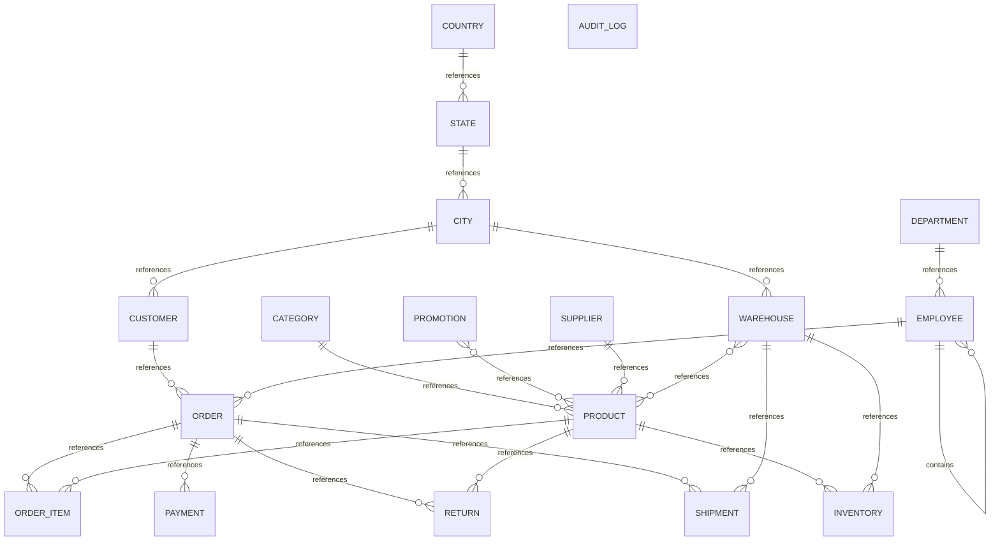

# Executive Summary

A multi-domain retail and supply chain system supporting customer orders, product inventory management across warehouses, supplier relationships, employee sales operations, and geographic hierarchies. The business manages product catalogs with promotional campaigns, fulfills orders through multiple warehouses with shipment tracking, processes customer payments, handles product returns, and maintains an audit trail of system operations.

> This conceptual model was generated by **claude-haiku-4-5-20251001** from the deterministic metadata, profile and relationship artifacts. It is an interpretation of the business the database appears to support, and should be reviewed by someone who knows that business. The Assumptions section lists where interpretation happened.

# Business Overview

- **Database:** datamodel
- **Business domains:** 7
- **Business entities:** 18
- **Entity relationships:** 21
- **Business rules identified:** 13

# Business Domains

## Geography

Master data for countries, states, cities, and warehouse locations that serve as reference points across the enterprise.

**Entities:** Country, State, City, Warehouse

## Catalog

Product master data including categorization, suppliers, pricing, and promotional campaigns.

**Entities:** Product, Category, Supplier, Promotion

## Sales

Customer master data, sales orders, order items, and sales representative management.

**Entities:** Customer, Order, Order Item

## Fulfillment

Warehouse inventory management, order shipments, and product returns processing.

**Entities:** Inventory, Shipment, Return

## Finance

Payment processing and financial transaction recording for customer orders.

**Entities:** Payment

## Organization

Employee master data, department structure, and management hierarchies.

**Entities:** Employee, Department

## Operations

System audit and operational logging of database changes.

**Entities:** Audit Log

# Business Entities

## Audit Log

System-generated record of all database operations (INSERT, UPDATE, DELETE) with timestamp and user information for compliance and troubleshooting.

**Business key:** operation_timestamp, table_name, user_name

**Attributes**

- operation
- user_name
- operation_timestamp

**Derived from:** `bronze.audit_log`

## Category

Product classification scheme that organizes the product catalog into logical groupings (e.g., Accessories, Storage).

**Business key:** category_name

**Attributes**

- category_name

**Derived from:** `bronze.category`

## City

City location record that belongs to a state, used for customer addresses and warehouse locations.

**Business key:** city_name, state_id

**Attributes**

- city_name

**Derived from:** `bronze.city`

## Country

Sovereign nation reference with ISO country code, serving as the top level of geographic hierarchy.

**Business key:** country_code

**Attributes**

- country_code
- country_name
- created_at

**Derived from:** `bronze.country`

## Customer

Individual or organization that places orders. Identified by a customer number and has a credit limit and active status.

**Business key:** customer_number

**Attributes**

- first_name
- last_name
- email
- phone
- credit_limit
- status

**Derived from:** `bronze.customer`

## Department

Organizational unit to which employees are assigned, representing teams or functions such as Finance or Support.

**Business key:** department_name

**Attributes**

- department_name

**Derived from:** `bronze.department`

## Employee

Person employed by the company who may be a sales representative, manager, or other operational role. Employees report to managers within a hierarchy.

**Business key:** email

**Attributes**

- first_name
- last_name
- salary
- hire_date

**Derived from:** `bronze.employee`

## Inventory

Stock position of a product at a specific warehouse, including current quantity on hand and reorder trigger level. This is a managed entity tracking supply.

**Business key:** warehouse_id, product_id

**Attributes**

- quantity
- reorder_level

**Derived from:** `bronze.inventory`

## Order

Customer purchase order placed on a specific date, assigned to a sales representative, with a fulfillment status (e.g., DELIVERED).

**Business key:** order_id

**Attributes**

- order_date
- order_status

**Derived from:** `bronze.orders`

## Order Item

Line item within an order specifying the product, quantity ordered, and unit price at time of sale.

**Business key:** order_id, line_number

**Attributes**

- quantity
- unit_price

**Derived from:** `bronze.order_item`

## Payment

Financial transaction recording customer payment against an order, including method (e.g., UPI), date, and amount.

**Business key:** payment_id

**Attributes**

- payment_method
- payment_date
- amount

**Derived from:** `bronze.payment`

## Product

Saleable item in the catalog, identified by SKU, with a category, supplier, unit price, and active status.

**Business key:** sku

**Attributes**

- product_name
- unit_price
- status

**Derived from:** `bronze.product`

## Promotion

Marketing campaign offering a discount percentage that can apply to one or more products.

**Business key:** promotion_name

**Attributes**

- discount_percent

**Derived from:** `bronze.promotion`

## Return

Record of a product being returned from an order, including the reason (e.g., Damaged).

**Business key:** return_id

**Attributes**

- return_reason

**Derived from:** `bronze.return_order`

## Shipment

Outbound movement of order fulfillment from a warehouse, with tracking number and shipment date.

**Business key:** tracking_number

**Attributes**

- shipped_date

**Derived from:** `bronze.shipment`

## Supplier

Vendor organization that supplies products to the company, with contact details.

**Business key:** supplier_name

**Attributes**

- contact_name
- email
- phone

**Derived from:** `bronze.supplier`

## State

Geographic subdivision of a country, used to organize cities and define regional hierarchies.

**Business key:** state_name, country_id

**Attributes**

- state_name

**Derived from:** `bronze.state`

## Warehouse

Physical location where inventory is stored and orders are fulfilled, situated in a city.

**Business key:** warehouse_name

**Attributes**

- warehouse_name

**Derived from:** `bronze.warehouse`

# Entity Relationships

| Entity | Relationship | Related Entity | Cardinality | Participation |
|---|---|---|---|---|
| Category | references | Product | one-to-many | optional |
| City | references | Customer | one-to-many | optional |
| City | references | Warehouse | one-to-many | optional |
| Country | references | State | one-to-many | mandatory |
| Customer | references | Order | one-to-many | optional |
| Department | references | Employee | one-to-many | optional |
| Employee | contains | Employee | one-to-many | optional |
| Employee | references | Order | one-to-many | optional |
| Order | references | Order Item | one-to-many | mandatory |
| Order | references | Payment | one-to-many | optional |
| Order | references | Return | one-to-many | optional |
| Order | references | Shipment | one-to-many | optional |
| Product | references | Inventory | one-to-many | mandatory |
| Product | references | Order Item | one-to-many | optional |
| Product | references | Return | one-to-many | optional |
| Promotion | references | Product | many-to-many | mandatory |
| Supplier | references | Product | one-to-many | optional |
| State | references | City | one-to-many | mandatory |
| Warehouse | references | Inventory | one-to-many | mandatory |
| Warehouse | references | Product | many-to-many | mandatory |
| Warehouse | references | Shipment | one-to-many | optional |

# Mermaid Diagram

# Business Rules

1. A customer has a credit limit that constrains purchase authority.
2. An order must be placed by a customer and assigned to a sales representative.
3. Products must be sourced from a supplier and categorized.
4. Inventory levels have a reorder point; when quantity falls below reorder_level, replenishment is triggered.
5. A promotion is a business mechanism that can apply to multiple products (many-to-many via Product Promotion link).
6. An order item captures the unit price at time of sale, decoupling it from current product price.
7. Shipments are fulfilled from specific warehouses and must relate to an order.
8. Returns can only be initiated against items in existing orders.
9. Employees form a reporting hierarchy where an employee may report to a manager (who is also an employee).
10. An employee belongs to a department and may serve as a sales representative.
11. Payments are recorded at the order level, not the order item level.
12. All database modifications are logged in the audit trail by the system.
13. Products are active until marked otherwise; customers are active until marked otherwise.

# Assumptions

1. Customer city_id is optional because some customers may not have a primary location recorded (e.g., phone/internet orders, multiple locations).
2. Employee department_id is optional because some employees may have temporary or unassigned status; manager_id is optional for top-level managers with no parent.
3. Order customer_id and sales_rep_id are optional because orders may be created in a draft or system-generated state before being fully assigned.
4. Product_promotion is a pure link table (no business attributes beyond the two keys) and is therefore not modeled as a business entity, but rather as a many-to-many relationship between Product and Promotion.
5. Return product_id is optional because a return record may be created at the order level before individual product details are recorded.
6. Shipment order_id and warehouse_id are optional to accommodate partial shipments or system initialization scenarios.
7. Payment order_id is optional to support pre-authorization or deferred payment scenarios.
8. Order item product_id is optional in the logical schema; in practice, an order item without a product would be anomalous.
9. The Audit Log table has no foreign key relationships and is treated as an operational system artifact rather than a business entity owned by any domain.
10. Geographic hierarchy is assumed to be: Country → State → City → Warehouse/Customer location. All samples show India locations.
11. Category name and Product SKU are treated as business identifiers because they are formatted codes with high cardinality and represent how the business refers to these entities.
12. Employee email is treated as the business key because it is unique, stable, and human-recognizable, even though the system uses employee_id as the primary key.
13. Customer number (e.g., CUST001) is the business identifier; the numeric customer_id is a surrogate key.
14. A Shipment is assumed to represent the act of shipping an order (or part of an order) from a warehouse, distinct from the order itself. Shipment is a business event entity.
15. Return is inferred as a separate business entity from Order Item because it captures post-sale customer actions and reasons, not fulfillment logistics.
16. Promotion discount_percent field is a numeric value; the business rule for applying it to orders is not visible in the schema and is assumed to happen at order line or header level outside this model.

# Recommendations

1. Clarify the cardinality and optionality of the Payment entity. Consider whether an order must have a payment record or whether orders can exist in unpaid states for extended periods.
2. Define explicit business rules for when and why a product's status changes from ACTIVE to another state, and whether archived products remain queryable.
3. Establish ownership of the Product-Promotion many-to-many relationship: is it maintained by Marketing, Sales, or Product Management?
4. Document the Return process: is a return always against an order item, or can returns be issued independently? Current optionality suggests the latter.
5. Add an Order Status dimension or lookup to formalize valid order states (PENDING, DELIVERED, CANCELLED, etc.) if not already defined in application logic.
6. Consider whether Shipment should be explicitly linked to Order Item (line item detail) rather than only to Order, to enable partial shipments and backorder tracking.
7. Clarify the role of sales_rep_id in the Order: does this represent account ownership, the rep who took the order, or the rep responsible for fulfillment?
8. Audit Log has no declared relationships. Confirm whether audit records should be linked to specific customers, employees, or orders to enable accountability and forensics.
9. Introduce explicit Business Rules or Constraint entities if complex validation rules (credit limits, approval workflows, etc.) need to be versioned and tracked.
10. Consider adding a Product SKU audit trail if products are revised, to distinguish historical pricing from current pricing in order analysis.
