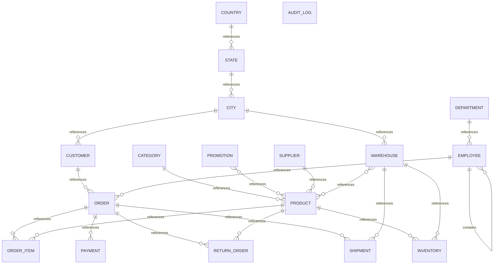

# Executive Summary

A multi-domain business system supporting sales order management, product inventory, customer relationships, and supply chain operations. The database tracks customers placing orders for products, which are sourced from suppliers and held in geographically distributed warehouses. Sales representatives manage customer relationships. Products are categorized and may participate in promotional campaigns. Orders flow through payment, shipment, and optionally return processes. The organization is structured around departments and reporting hierarchies.

> This conceptual model was generated by **claude-haiku-4-5-20251001** from the deterministic metadata, profile and relationship artifacts. It is an interpretation of the business the database appears to support, and should be reviewed by someone who knows that business. The Assumptions section lists where interpretation happened.

# Business Overview

- **Database:** datamodel
- **Business domains:** 6
- **Business entities:** 18
- **Entity relationships:** 21
- **Business rules identified:** 21

# Business Domains

## Sales & Customer Management

Manages customers, their orders, and the sales representatives who service them.

**Entities:** Customer, Order, Employee

## Product & Inventory

Manages product catalog, supplier relationships, categories, and stock levels across warehouses.

**Entities:** Product, Supplier, Category, Warehouse, Inventory

## Order Fulfillment

Manages the complete order lifecycle: line items, payments, shipments, and returns.

**Entities:** Order Item, Payment, Shipment, Return Order

## Promotions

Manages promotional campaigns and their associations with products.

**Entities:** Promotion

## Geography & Organization

Defines organizational structure, reporting hierarchies, and geographic locations.

**Entities:** Employee, Department, Country, State, City

## System Administration

Tracks data changes and system operations.

**Entities:** Audit Log

# Business Entities

## Customer

A person or business entity that purchases products. Customers have credit limits and geographic locations.

**Business key:** customer_number

**Attributes**

- first_name
- last_name
- email
- phone
- credit_limit
- status

**Derived from:** `bronze.customer`

## Order

A request by a customer to purchase products, recorded with order date and status. May be assigned to a sales representative.

**Business key:** order_id

**Attributes**

- order_date
- order_status

**Derived from:** `bronze.orders`

## Order Item

A line item within an order, specifying a product, quantity, and unit price at the time of order.

**Business key:** order_id, line_number

**Attributes**

- quantity
- unit_price

**Derived from:** `bronze.order_item`

## Payment

A financial transaction recording payment received for an order via a specified payment method.

**Business key:** payment_id

**Attributes**

- payment_method
- payment_date
- amount

**Derived from:** `bronze.payment`

## Shipment

A fulfillment record tracking the dispatch of an order from a warehouse with a tracking number.

**Business key:** shipment_id

**Attributes**

- shipped_date
- tracking_number

**Derived from:** `bronze.shipment`

## Return Order

A product return request tied to an original order, including the return reason.

**Business key:** return_id

**Attributes**

- return_reason

**Derived from:** `bronze.return_order`

## Product

A tangible item offered for sale, with a SKU, unit price, category, and supplier. Has active/inactive status.

**Business key:** sku

**Attributes**

- product_name
- unit_price
- status

**Derived from:** `bronze.product`

## Supplier

An external party that provides products to the business.

**Business key:** supplier_name

**Attributes**

- contact_name
- email
- phone

**Derived from:** `bronze.supplier`

## Category

A classification grouping related products together (e.g., Accessories, Storage).

**Business key:** category_name

**Derived from:** `bronze.category`

## Warehouse

A physical location where inventory is stored and orders are fulfilled.

**Business key:** warehouse_name

**Derived from:** `bronze.warehouse`

## Inventory

The quantity of a product held at a specific warehouse, with reorder thresholds.

**Business key:** warehouse_name, product_sku

**Attributes**

- quantity
- reorder_level

**Derived from:** `bronze.inventory`

## Promotion

A time-bound or product-bound marketing campaign offering a discount.

**Business key:** promotion_name

**Attributes**

- discount_percent

**Derived from:** `bronze.promotion`

## Employee

A member of the organization who may be a sales representative or manager. Employees have departments and report to managers.

**Business key:** email

**Attributes**

- first_name
- last_name
- salary
- hire_date

**Derived from:** `bronze.employee`

## Department

An organizational unit grouping employees by function.

**Business key:** department_name

**Derived from:** `bronze.department`

## Country

A nation recognized for business and geographic purposes.

**Business key:** country_code

**Attributes**

- country_name
- created_at

**Derived from:** `bronze.country`

## State

A provincial or state-level geographic subdivision of a country.

**Business key:** state_name

**Derived from:** `bronze.state`

## City

A city or municipal area serving as a location for customers and warehouses.

**Business key:** city_name

**Derived from:** `bronze.city`

## Audit Log

A system record of data operations (INSERT, UPDATE, DELETE) for compliance and audit purposes.

**Business key:** audit_id

**Attributes**

- table_name
- operation
- user_name
- operation_timestamp

**Derived from:** `bronze.audit_log`

# Entity Relationships

| Entity | Relationship | Related Entity | Cardinality | Participation |
|---|---|---|---|---|
| Customer | references | Order | one-to-many | optional |
| Order | references | Order Item | one-to-many | mandatory |
| Order | references | Payment | one-to-many | optional |
| Order | references | Return Order | one-to-many | optional |
| Order | references | Shipment | one-to-many | optional |
| Product | references | Inventory | one-to-many | mandatory |
| Product | references | Order Item | one-to-many | optional |
| Product | references | Return Order | one-to-many | optional |
| Supplier | references | Product | one-to-many | optional |
| Category | references | Product | one-to-many | optional |
| Warehouse | references | Inventory | one-to-many | mandatory |
| Warehouse | references | Product | many-to-many | mandatory |
| Warehouse | references | Shipment | one-to-many | optional |
| Promotion | references | Product | many-to-many | mandatory |
| Employee | contains | Employee | one-to-many | optional |
| Employee | references | Order | one-to-many | optional |
| Department | references | Employee | one-to-many | optional |
| Country | references | State | one-to-many | mandatory |
| State | references | City | one-to-many | mandatory |
| City | references | Customer | one-to-many | optional |
| City | references | Warehouse | one-to-many | optional |

# Mermaid Diagram

# Business Rules

1. A customer may place zero or more orders.
2. An order must be associated with a customer (foreign key is optional in schema, but semantically expected).
3. An order may be assigned to a sales representative (employee).
4. An order contains one or more order items.
5. An order item references a product (optional in schema but logically required).
6. An order may generate zero or more payments.
7. An order may generate zero or more shipments.
8. An order may be subject to zero or more return requests.
9. A product must have a supplier.
10. A product must be categorized.
11. A product may participate in zero or more promotions.
12. A product is held in inventory at one or more warehouses.
13. A promotion may apply to zero or more products.
14. Inventory is tracked per warehouse-product combination with a reorder level.
15. An employee may manage zero or more employees (through manager_id self-reference).
16. An employee works in a department (optional in schema).
17. An employee may act as a sales representative for orders.
18. A warehouse is located in a city.
19. A customer resides in a city (optional).
20. A city belongs to exactly one state.
21. A state belongs to exactly one country.

# Assumptions

1. Customer.city_id is optional in the schema but typically populated; we interpret it as the customer's primary location.
2. Employee.manager_id is self-referential and optional (10% null), indicating that some employees (likely executives) have no manager.
3. Employee.department_id is optional but expected to be populated for most employees.
4. Order.customer_id is marked optional but semantically every order should have a customer; treat as logically required.
5. Order.sales_rep_id is optional, reflecting that some orders may not be assigned to a specific sales representative or may be direct/online.
6. Order Item.product_id is optional in the schema, which is unusual; we assume this is a data quality issue and that every order item should reference a product.
7. Payment.order_id is optional, allowing for advance or post-order payments or out-of-order payment records; we treat payment as loosely bound to orders.
8. Shipment and Return Order references to Order are optional, suggesting some orders may not be shipped or returned.
9. The junction table product_promotion is a pure link (no additional attributes), expressing a many-to-many relationship.
10. The junction table inventory is not a pure link; it carries quantity and reorder_level attributes and therefore qualifies as a business entity in its own right.
11. Geography hierarchy is complete: Country > State > City, with all relationships declared.
12. Audit Log is orphaned (no foreign keys point to or from it), confirming it is a system table outside the main business model.
13. All distinct_count and sample_range values are example data only; the conceptual model applies regardless of current data volume.
14. The structure implies a transactional e-commerce or wholesale order management system, likely serving B2B or B2C sales channels.

# Recommendations

1. Clarify ownership of the Promotion domain: is marketing responsible for campaigns, or is sales? Define who owns the product-promotion association.
2. Review Order Item product_id nullability; every line item should reference a product. Consider NOT NULL constraint.
3. Establish clear SLA for Payment.order_id: should every payment tie to an order, or are advance payments and credits legitimate?
4. Document the business rule for Department assignment: is it mandatory for all employees? The schema allows null but discipline may be needed.
5. Consider whether Warehouse should have a status field to distinguish active vs. inactive locations for inventory planning.
6. Define the lifecycle and retention policy for Audit Log: is it required indefinitely, or can it be archived after a retention period?
7. Validate the geography structure: all sample data references a single country; confirm whether the system is truly multi-national or if state/country tables are templates.
8. Add a tracking entity if needed: does the business require detailed shipment tracking milestones (picked, packed, in-transit, delivered), or is tracking_number sufficient?
