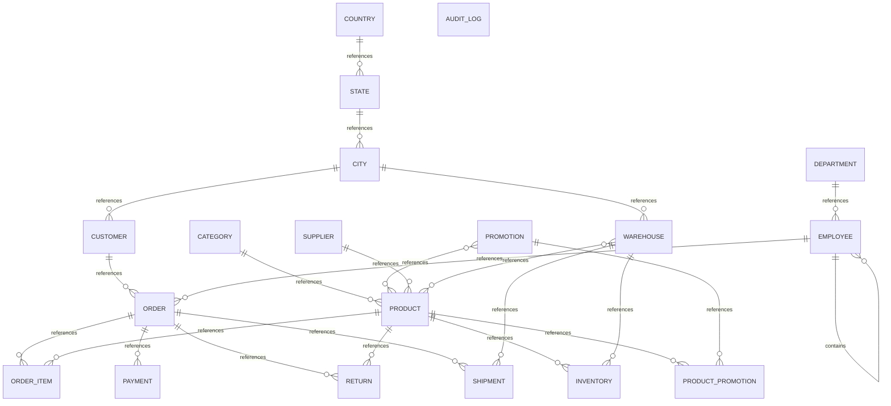

# Executive Summary

A retail and supply chain management system that tracks products, inventory, customers, orders, payments, shipments, and returns. The system supports sales operations with employee management, geographical hierarchies, promotional campaigns, and supplier relationships.

> This conceptual model was generated by **claude-haiku-4-5-20251001** from the deterministic metadata, profile and relationship artifacts. It is an interpretation of the business the database appears to support, and should be reviewed by someone who knows that business. The Assumptions section lists where interpretation happened.

# Business Overview

- **Database:** datamodel
- **Business domains:** 7
- **Business entities:** 19
- **Entity relationships:** 23
- **Business rules identified:** 16

# Business Domains

## Geography

Reference data for locations, organized hierarchically from countries down to cities.

**Entities:** Country, State, City

## Organization

Internal organizational structure including employees and their departments.

**Entities:** Department, Employee

## Product Management

Product catalog, supplier relationships, categories, and inventory levels across warehouses.

**Entities:** Product, Category, Supplier, Warehouse, Inventory

## Promotions

Marketing campaigns and promotional offers applied to products.

**Entities:** Promotion, Product Promotion

## Sales

Customer transactions, orders, and associated payments.

**Entities:** Customer, Order, Order Item, Payment

## Fulfillment

Post-sale operations including shipments and product returns.

**Entities:** Shipment, Return

## Audit

System audit trail for data changes.

**Entities:** Audit Log

# Business Entities

## Country

A country where the business operates or has customers.

**Business key:** country_code

**Attributes**

- country_name
- created_at

**Derived from:** `bronze.country`

## State

A state or province within a country.

**Business key:** state_name, country_code

**Derived from:** `bronze.state`

## City

A city within a state.

**Business key:** city_name, state_name

**Derived from:** `bronze.city`

## Department

An organizational department that employs staff.

**Business key:** department_name

**Derived from:** `bronze.department`

## Employee

A member of the workforce with a role and reporting structure.

**Business key:** email

**Attributes**

- first_name
- last_name
- salary
- hire_date

**Derived from:** `bronze.employee`

## Category

A product category used to classify products.

**Business key:** category_name

**Derived from:** `bronze.category`

## Supplier

A vendor who supplies products to the business.

**Business key:** supplier_name

**Attributes**

- contact_name
- email
- phone

**Derived from:** `bronze.supplier`

## Product

An item offered for sale, sourced from suppliers and organized into categories.

**Business key:** sku

**Attributes**

- product_name
- unit_price
- status

**Derived from:** `bronze.product`

## Warehouse

A physical location where inventory is stored and orders are fulfilled from.

**Business key:** warehouse_name

**Derived from:** `bronze.warehouse`

## Inventory

Stock levels of products held at specific warehouses, including reorder thresholds.

**Business key:** warehouse_name, sku

**Attributes**

- quantity
- reorder_level

**Derived from:** `bronze.inventory`

## Promotion

A marketing campaign that offers discounts on selected products.

**Business key:** promotion_name

**Attributes**

- discount_percent

**Derived from:** `bronze.promotion`

## Product Promotion

The association between a product and a promotional offer.

**Business key:** sku, promotion_name

**Derived from:** `bronze.product_promotion`

## Customer

An end customer who purchases products.

**Business key:** customer_number

**Attributes**

- first_name
- last_name
- email
- phone
- credit_limit
- status

**Derived from:** `bronze.customer`

## Order

A customer purchase transaction including one or more items.

**Business key:** order_id

**Attributes**

- order_date
- order_status

**Derived from:** `bronze.orders`

## Order Item

A line item within an order specifying a product and quantity.

**Business key:** order_id, line_number

**Attributes**

- quantity
- unit_price

**Derived from:** `bronze.order_item`

## Payment

A payment received for an order.

**Business key:** payment_id

**Attributes**

- payment_method
- payment_date
- amount

**Derived from:** `bronze.payment`

## Shipment

The dispatch of an order from a warehouse to a customer.

**Business key:** tracking_number

**Attributes**

- shipped_date

**Derived from:** `bronze.shipment`

## Return

A product returned by a customer from an order, with a reason recorded.

**Business key:** return_id

**Attributes**

- return_reason

**Derived from:** `bronze.return_order`

## Audit Log

A system record of data changes for compliance and troubleshooting.

**Business key:** audit_id

**Attributes**

- table_name
- operation
- user_name
- operation_timestamp

**Derived from:** `bronze.audit_log`

# Entity Relationships

| Entity | Relationship | Related Entity | Cardinality | Participation |
|---|---|---|---|---|
| Country | references | State | one-to-many | mandatory |
| State | references | City | one-to-many | mandatory |
| City | references | Customer | one-to-many | optional |
| City | references | Warehouse | one-to-many | optional |
| Department | references | Employee | one-to-many | optional |
| Employee | contains | Employee | one-to-many | optional |
| Employee | references | Order | one-to-many | optional |
| Category | references | Product | one-to-many | optional |
| Supplier | references | Product | one-to-many | optional |
| Product | references | Inventory | one-to-many | mandatory |
| Product | references | Order Item | one-to-many | optional |
| Product | references | Product Promotion | one-to-many | mandatory |
| Product | references | Return | one-to-many | optional |
| Warehouse | references | Inventory | one-to-many | mandatory |
| Warehouse | references | Product | many-to-many | mandatory |
| Warehouse | references | Shipment | one-to-many | optional |
| Promotion | references | Product | many-to-many | mandatory |
| Promotion | references | Product Promotion | one-to-many | mandatory |
| Customer | references | Order | one-to-many | optional |
| Order | references | Order Item | one-to-many | mandatory |
| Order | references | Payment | one-to-many | optional |
| Order | references | Return | one-to-many | optional |
| Order | references | Shipment | one-to-many | optional |

# Mermaid Diagram

# Business Rules

1. A customer must have a city of residence, though it may not be recorded.
2. An employee must be assigned to a department, though it may be optional in the data.
3. An employee may report to a manager, who is also an employee, creating a hierarchy.
4. A product must be sourced from a supplier, though the supplier may not be mandatory.
5. A product belongs to a category, though the assignment may be optional.
6. Inventory is tracked as a stock level per product per warehouse with a reorder level threshold.
7. An order must be placed by a customer, though customer reference may be optional.
8. An order line item must reference an order and optionally a product.
9. A payment is associated with an order, though the reference may be optional.
10. A shipment must ship from a warehouse, though the warehouse reference may be optional.
11. A return must reference an order and optionally a product.
12. A promotion may apply to zero, one, or many products via the product promotion junction.
13. Only one country is currently present in the sample data, suggesting a single-nation focus or data limitation.
14. Order status and product status are controlled vocabularies (e.g., ACTIVE, DELIVERED).
15. Payment method is a controlled vocabulary (e.g., UPI).
16. Return reason is a controlled vocabulary (e.g., Damaged).

# Assumptions

1. The business key for Customer is customer_number (formatted value CUST001, etc.) because it is the natural external identifier, not the internal customer_id.
2. The business key for Product is sku (formatted as SKU001, etc.) because it is the industry-standard identifier for inventory management.
3. The business key for Shipment is tracking_number because it is the external identifier used for customer tracking and logistics.
4. Product Promotion is a junction entity rather than a pure link because the analysis marked it as a pure link with no extra attributes, meaning it purely represents the many-to-many relationship between Product and Promotion.
5. The employee.manager_id self-reference is optional (10% null), indicating some employees (likely senior staff) do not have a manager.
6. City is optional in the Customer entity because customer.city_id is nullable, reflecting that some customers may not have a recorded location.
7. Department is optional in the Employee entity even though the analysis shows no nulls, the relationship definition marks it optional, suggesting business flexibility.
8. Sales_rep_id in Order is optional, meaning not all orders are assigned to a sales representative.
9. Product reference in Order Item is optional, suggesting items can exist without a known product (e.g., custom items or deleted products).
10. Product reference in Return is optional, suggesting return records may be created before product details are fully resolved.
11. Warehouse reference in Shipment is optional, though logically every shipment should originate from a warehouse—this may indicate data quality variance or pending shipment records.
12. The sample data contains exactly 10 rows per table with very similar counts of distinct values, suggesting this is a small demonstration or test dataset rather than production data.
13. The created_at timestamp on Country suggests an audit-like tracking mechanism for reference data.
14. All employees have hire dates in the same range (2023-01-01 to 2023-01-10), indicating either a cohort hire or synthetic data.
15. Reorder_level is constant (20) across all inventory records in the sample, suggesting either a default or a data artifact.
16. The audit_log table is not connected to any other entity by foreign key, making it an orphan. This may be intentional (application-triggered logging) or a missing relationship in the schema.
17. Some columns marked as category or formatted_value appear to be continuous or sparse (e.g., salary, unit_price, amount) rather than controlled lists, but the analysis role designation may reflect how they are displayed rather than their domain.

# Recommendations

1. Clarify the business rules around optional product references in Order Item and Return. If these are truly optional, document why; if not, add NOT NULL constraints and investigate data quality.
2. Establish and document controlled vocabularies for order_status, product.status, payment_method, and return_reason so they can be validated at ingestion.
3. Confirm whether the audit_log orphan table is intentional or whether it should include foreign keys to track which entities were modified.
4. Consider whether the manager_id self-reference should enforce a hierarchy depth limit or prevent circular reporting to maintain data integrity.
5. Review the warehouse_id foreign key in the Shipment table—it is marked optional but logically every shipment must originate from a location; make it mandatory if data quality permits.
6. Verify that the single country in the sample data is a data limitation or an actual single-market focus; if multi-country support is needed, review Country and State design.
7. Document the purpose of the Product Promotion junction: is it purely transactional (product can be in many promotions) or does it carry historical or temporal meaning?
8. Consider adding explicit timestamps (created_at, updated_at) to transactional entities (Order, Payment, Return, Shipment) for audit and reconciliation.
9. Review the cardinality and optionality of the sales_rep_id reference in Order. If sales rep assignment is mandatory for accountability, enforce it; if optional, document when it may be null.
10. Consider whether Customer Location should be a separate entity if customers can have multiple addresses (billing, shipping) or if a single city per customer is sufficient for the business model.
