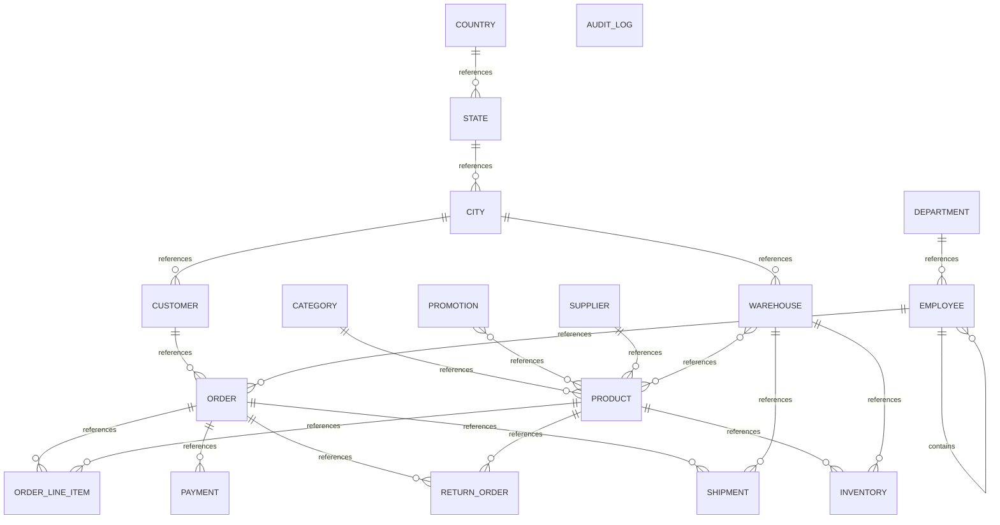

# Executive Summary

A retail and order management system supporting customer orders, inventory management, product catalog, supplier relationships, employee management, and fulfillment operations. The system tracks products across multiple warehouses, manages customer and supplier interactions, processes orders with line items and payments, handles shipments and returns, and maintains organizational structure with departments and reporting relationships.

> This conceptual model was generated by **claude-haiku-4-5-20251001** from the deterministic metadata, profile and relationship artifacts. It is an interpretation of the business the database appears to support, and should be reviewed by someone who knows that business. The Assumptions section lists where interpretation happened.

# Business Overview

- **Database:** datamodel
- **Business domains:** 6
- **Business entities:** 18
- **Entity relationships:** 21
- **Business rules identified:** 11

# Business Domains

## Master Data

Reference data that describes entities used throughout the system — customers, products, suppliers, employees, and geographic locations.

**Entities:** Customer, Product, Supplier, Employee, Department, Country, State, City, Category

## Inventory & Warehousing

Management of stock levels, warehouse locations, and inventory tracking across distribution centers.

**Entities:** Warehouse, Inventory

## Sales & Ordering

Customer orders, sales transactions, order line items, and sales representative management.

**Entities:** Order, Order Line Item, Promotion

## Fulfillment & Logistics

Shipment tracking, delivery management, and product returns.

**Entities:** Shipment, Return Order

## Financial

Payment processing and transaction records.

**Entities:** Payment

## System Administration

Audit and system operational tracking.

**Entities:** Audit Log

# Business Entities

## Customer

A person or organization that purchases products from the business.

**Business key:** customer_number

**Attributes**

- first_name
- last_name
- email
- phone
- credit_limit
- status

**Derived from:** `bronze.customer`

## Product

An item offered for sale, identified by SKU, with pricing and supplier relationships.

**Business key:** sku

**Attributes**

- product_name
- unit_price
- status

**Derived from:** `bronze.product`

## Supplier

A vendor that provides products to the business.

**Business key:** supplier_name

**Attributes**

- contact_name
- email
- phone

**Derived from:** `bronze.supplier`

## Employee

A person employed by the organization, potentially reporting to a manager within a department.

**Business key:** email

**Attributes**

- first_name
- last_name
- salary
- hire_date

**Derived from:** `bronze.employee`

## Department

An organizational unit within the company to which employees are assigned.

**Business key:** department_name

**Derived from:** `bronze.department`

## Country

A sovereign nation used to classify geographic locations.

**Business key:** country_code

**Attributes**

- country_name
- created_at

**Derived from:** `bronze.country`

## State

A province or administrative region within a country.

**Business key:** state_name

**Derived from:** `bronze.state`

## City

A municipality or locality within a state.

**Business key:** city_name

**Derived from:** `bronze.city`

## Category

A product classification or type grouping similar products.

**Business key:** category_name

**Derived from:** `bronze.category`

## Warehouse

A physical distribution center or storage facility where inventory is held.

**Business key:** warehouse_name

**Derived from:** `bronze.warehouse`

## Inventory

The quantity of a product held at a specific warehouse, with tracking of reorder levels.

**Business key:** warehouse_name, product_name

**Attributes**

- quantity
- reorder_level

**Derived from:** `bronze.inventory`

## Order

A customer purchase transaction containing one or more line items, placed on a specific date and tracked to completion.

**Business key:** order_id

**Attributes**

- order_date
- order_status

**Derived from:** `bronze.orders`

## Order Line Item

A single product and quantity within an order, at a specific unit price.

**Business key:** order_id, line_number

**Attributes**

- quantity
- unit_price

**Derived from:** `bronze.order_item`

## Promotion

A marketing campaign or discount offer that can be applied to products.

**Business key:** promotion_name

**Attributes**

- discount_percent

**Derived from:** `bronze.promotion`

## Shipment

The fulfillment and delivery of an order from a warehouse, with tracking information.

**Business key:** tracking_number

**Attributes**

- shipped_date

**Derived from:** `bronze.shipment`

## Return Order

A product returned by a customer from a placed order, with reason documented.

**Business key:** return_id

**Attributes**

- return_reason

**Derived from:** `bronze.return_order`

## Payment

A financial transaction settling a customer's order invoice.

**Business key:** payment_id

**Attributes**

- payment_method
- payment_date
- amount

**Derived from:** `bronze.payment`

## Audit Log

A system record of all database operations for compliance and troubleshooting.

**Business key:** audit_id

**Attributes**

- table_name
- operation
- user_name
- operation_timestamp

**Derived from:** `bronze.audit_log`

# Entity Relationships

| Entity | Relationship | Related Entity | Cardinality | Participation |
|---|---|---|---|---|
| Customer | references | Order | one-to-many | optional |
| Product | references | Inventory | one-to-many | mandatory |
| Product | references | Order Line Item | one-to-many | optional |
| Product | references | Return Order | one-to-many | optional |
| Supplier | references | Product | one-to-many | optional |
| Employee | contains | Employee | one-to-many | optional |
| Employee | references | Order | one-to-many | optional |
| Department | references | Employee | one-to-many | optional |
| Country | references | State | one-to-many | mandatory |
| State | references | City | one-to-many | mandatory |
| City | references | Customer | one-to-many | optional |
| City | references | Warehouse | one-to-many | optional |
| Category | references | Product | one-to-many | optional |
| Warehouse | references | Inventory | one-to-many | mandatory |
| Warehouse | references | Product | many-to-many | mandatory |
| Warehouse | references | Shipment | one-to-many | optional |
| Order | references | Order Line Item | one-to-many | mandatory |
| Order | references | Payment | one-to-many | optional |
| Order | references | Return Order | one-to-many | optional |
| Order | references | Shipment | one-to-many | optional |
| Promotion | references | Product | many-to-many | mandatory |

# Mermaid Diagram

# Business Rules

1. A customer must have a credit limit that governs their purchasing authority.
2. Products are assigned to a single category and sourced from a single supplier.
3. A product may be promoted through zero or more promotions; promotions apply to one or more products.
4. Inventory is tracked as the quantity of each product held in each warehouse, with a reorder level threshold to trigger replenishment.
5. An order is placed by a customer and managed by a sales representative (employee); the order header captures the order date and status.
6. An order comprises one or more line items, each specifying a product, quantity, and unit price at time of order.
7. A payment is applied to an order; an order may have zero or one payment recorded (or multiple payments, depending on fulfillment state).
8. A shipment originates from a warehouse and fulfills an order; shipments carry tracking numbers.
9. A return can be initiated against an order and a specific product with a documented reason.
10. An employee reports to a manager (another employee) within a department; not all employees have managers (they may be top-level).
11. Customers and warehouses are located in cities; cities are in states; states are in countries.

# Assumptions

1. The business key for Customer is customer_number (a formatted identifier like 'CUST001') rather than the surrogate customer_id, as it is the human-facing identifier.
2. The business key for Product is sku rather than product_id, as SKU is the universal product code in retail.
3. The business key for Promotion is promotion_name, as promotions are identified by their campaign name in business operations.
4. The business key for Shipment is tracking_number, as this is how customers and logistics teams identify a shipment in the real world.
5. Payment is treated as an entity despite having an optional relationship to Order; it is assumed that payments are recorded independently and may be matched to orders later or in a different process.
6. Audit Log is included as an entity though it is orphaned (no foreign keys reference it). It captures system operations and is part of the operational data model.
7. The relationship from Product to Promotion is many-to-many; the junction table product_promotion is a pure link with no additional business attributes, so it is not exposed as a separate entity but instead modeled as a many-to-many relationship.
8. Inventory is modeled as a business entity (not merely a junction table) because it carries business attributes (quantity and reorder_level) beyond the simple product-warehouse link.
9. Order Line Item is treated as a full entity because it captures order-specific pricing and quantity distinct from the product's unit price.
10. Return Order is assumed to be initiated after an order is placed; the structure suggests one return per return_id, but a business rule likely limits returns to valid order line items.
11. Payment method and payment date are attributes of Payment; the amount represents what was paid and may differ from the order total if partial payments are supported.
12. Employees can be sales representatives; those with sales_rep_id on orders are the Employee entities in a sales role.
13. Department assignment is optional for employees, implying some employees may be unassigned or in a pending state.
14. Customer city assignment is optional, allowing customers without a recorded location.
15. Warehouse city assignment is optional, though unusual; warehouses may be in a setup or unknown-location state.
16. All geographic rollups (Country → State → City) are mandatory in the hierarchy; customers and warehouses reference cities, which reference states, which reference countries, establishing a full geographic dimension.

# Recommendations

1. Clarify whether a single Order can have multiple Payments (e.g., partial payments) or only one. The schema allows optional payment, but reconciliation logic should be explicit.
2. Consider whether Return Order should be a line-item-level entity (allowing partial returns of an order item) or remain order-product scoped. The current model does not enforce that the product being returned was in the order being referenced.
3. Establish data quality rules: ensure that every Order has a Customer and every Order Line Item has a Product before going to production, or accept the business implications of null foreign keys.
4. Document the Employee hierarchy rules: can managers form cycles? What is the maximum depth of the reporting structure? Should there be a root executive with no manager?
5. Consider adding a Product-Promotion relationship end-date or validity period if promotions are time-bound campaigns.
6. Audit Log is disconnected from the main data model. Decide whether to link it to affected entities (e.g., Order audit logs) or keep it as a general system log.
7. Review Inventory reorder_level: the sample shows a single value (20) across all rows. Confirm whether this is a real constant or a data artifact; if variable, ensure reorder logic is enforced in business processes.
8. Ensure Order status values (e.g., 'DELIVERED') and Payment method values (e.g., 'UPI') are validated against a controlled vocabulary list documented in a separate configuration or reference table.
9. Validate whether Product status and Customer status should be linked or are independent state machines.
10. Confirm whether Shipment is always initiated from a single Warehouse or whether split shipments from multiple warehouses for one order are possible; the current schema allows only one warehouse per shipment.
