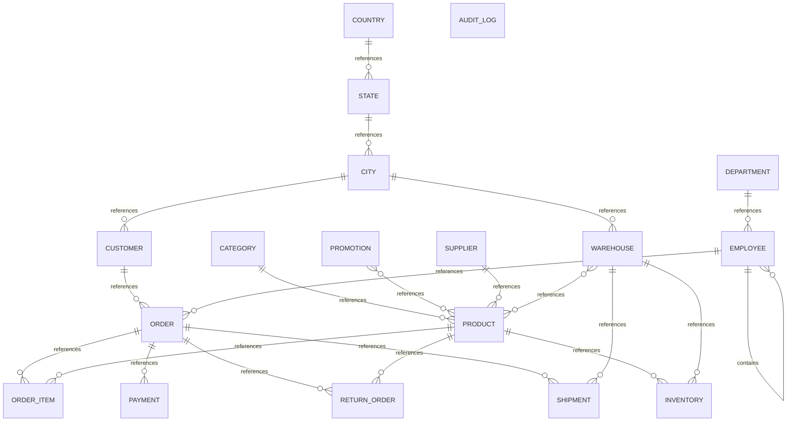

# Executive Summary

A comprehensive retail and supply chain management system that tracks products, inventory across warehouses, customer orders, payments, shipments, returns, and promotional activities. The system also manages employee and organizational structures with departments and reporting hierarchies, along with geographic master data (countries, states, cities). Audit logging tracks all data changes for compliance.

> This conceptual model was generated by **claude-haiku-4-5-20251001** from the deterministic metadata, profile and relationship artifacts. It is an interpretation of the business the database appears to support, and should be reviewed by someone who knows that business. The Assumptions section lists where interpretation happened.

# Business Overview

- **Database:** datamodel
- **Business domains:** 6
- **Business entities:** 18
- **Entity relationships:** 21
- **Business rules identified:** 17

# Business Domains

## Geography

Master data for locations where customers, warehouses, and suppliers operate.

**Entities:** Country, State, City

## Organization

Internal company structure including employees, departments, and reporting relationships.

**Entities:** Department, Employee

## Product Master

Product catalog, categorization, supplier relationships, and inventory management.

**Entities:** Product, Category, Supplier, Inventory, Promotion

## Sales

Customer information, order capture, order line items, and payment processing.

**Entities:** Customer, Order, Order Item, Payment

## Fulfillment

Shipment and return processing for orders.

**Entities:** Shipment, Return Order

## Audit & Compliance

System audit logging for tracking changes to data.

**Entities:** Audit Log

# Business Entities

## Country

Sovereign nations and territories where the business operates or has customers and suppliers.

**Business key:** country_code

**Attributes**

- country_name
- created_at

**Derived from:** `bronze.country`

## State

States or provinces within countries used for geographic organization of customers and warehouses.

**Business key:** state_name, country_id

**Attributes**

- state_name

**Derived from:** `bronze.state`

## City

Cities within states, the primary geographic unit for customer location and warehouse placement.

**Business key:** city_name, state_id

**Attributes**

- city_name

**Derived from:** `bronze.city`

## Department

Organizational departments within the company (Finance, Support, etc.) that group employees.

**Business key:** department_name

**Attributes**

- department_name

**Derived from:** `bronze.department`

## Employee

Company staff members with role, compensation, and hierarchical reporting structure.

**Business key:** email

**Attributes**

- first_name
- last_name
- salary
- hire_date

**Derived from:** `bronze.employee`

## Category

Product categories used to classify and organize the product catalog (Accessories, Storage, etc.).

**Business key:** category_name

**Attributes**

- category_name

**Derived from:** `bronze.category`

## Supplier

External vendors who supply products to the organization.

**Business key:** supplier_name

**Attributes**

- contact_name
- email
- phone

**Derived from:** `bronze.supplier`

## Product

Goods sold and inventoried by the business, with pricing, supplier sourcing, and category classification.

**Business key:** sku

**Attributes**

- product_name
- unit_price
- status

**Derived from:** `bronze.product`

## Promotion

Discount and promotional campaigns that can be applied to products.

**Business key:** promotion_name

**Attributes**

- discount_percent

**Derived from:** `bronze.promotion`

## Inventory

Stock levels of products held at specific warehouses, with reorder thresholds for supply chain management.

**Business key:** product_id, warehouse_id

**Attributes**

- quantity
- reorder_level

**Derived from:** `bronze.inventory`

## Warehouse

Physical distribution centers that hold inventory and ship orders to customers.

**Business key:** warehouse_name

**Attributes**

- warehouse_name

**Derived from:** `bronze.warehouse`

## Customer

End customers who purchase products and place orders.

**Business key:** customer_number

**Attributes**

- first_name
- last_name
- email
- phone
- credit_limit
- status

**Derived from:** `bronze.customer`

## Order

Sales transactions placed by customers, managed by sales representatives and tracked through fulfillment.

**Business key:** order_id

**Attributes**

- order_date
- order_status

**Derived from:** `bronze.orders`

## Order Item

Individual line items within an order, specifying products, quantities, and unit prices.

**Business key:** order_id, line_number

**Attributes**

- quantity
- unit_price

**Derived from:** `bronze.order_item`

## Payment

Payment transactions received for orders, with method and date tracking.

**Business key:** payment_id

**Attributes**

- payment_method
- payment_date
- amount

**Derived from:** `bronze.payment`

## Shipment

Shipment records tracking the dispatch of orders from warehouses with tracking information.

**Business key:** tracking_number

**Attributes**

- shipped_date
- tracking_number

**Derived from:** `bronze.shipment`

## Return Order

Product returns initiated by customers for orders, with reason tracking.

**Business key:** return_id

**Attributes**

- return_reason

**Derived from:** `bronze.return_order`

## Audit Log

System audit trail recording all data modifications for compliance and traceability.

**Business key:** audit_id

**Attributes**

- table_name
- operation
- user_name
- operation_timestamp

**Derived from:** `bronze.audit_log`

# Entity Relationships

| Entity | Relationship | Related Entity | Cardinality | Participation |
|---|---|---|---|---|
| Country | references | State | one-to-many | mandatory |
| State | references | City | one-to-many | mandatory |
| City | references | Customer | one-to-many | optional |
| City | references | Warehouse | one-to-many | optional |
| Department | references | Employee | one-to-many | optional |
| Employee | contains | Employee | one-to-many | optional |
| Employee | references | Order | one-to-many | optional |
| Category | references | Product | one-to-many | optional |
| Supplier | references | Product | one-to-many | optional |
| Product | references | Inventory | one-to-many | mandatory |
| Product | references | Order Item | one-to-many | optional |
| Product | references | Return Order | one-to-many | optional |
| Promotion | references | Product | many-to-many | mandatory |
| Warehouse | references | Inventory | one-to-many | mandatory |
| Warehouse | references | Product | many-to-many | mandatory |
| Warehouse | references | Shipment | one-to-many | optional |
| Customer | references | Order | one-to-many | optional |
| Order | references | Order Item | one-to-many | mandatory |
| Order | references | Payment | one-to-many | optional |
| Order | references | Return Order | one-to-many | optional |
| Order | references | Shipment | one-to-many | optional |

# Mermaid Diagram

# Business Rules

1. Each city belongs to exactly one state.
2. Each state belongs to exactly one country.
3. Each employee may optionally belong to one department.
4. An employee may optionally report to another employee (manager), forming a hierarchical reporting structure; at most 10% of employees lack a manager (likely executives or top-level staff).
5. Each customer may optionally be located in a city; if not provided, city is unknown or handled separately.
6. Each product belongs to one category and is supplied by one supplier, both optional in the data model.
7. A product may be available in multiple warehouses; each warehouse maintains a specific quantity and reorder level for that product.
8. A product can be promoted through multiple promotions simultaneously, and a promotion can apply to multiple products (many-to-many relationship).
9. Each order is placed by one customer and managed by one sales representative (employee), both optional in recorded data.
10. An order consists of one or more line items, each specifying a product, quantity, and unit price.
11. An order may be paid through one or more payments (optional payment recorded in data).
12. An order may generate one or more shipments from one or more warehouses (optional in recorded data).
13. An order may have one or more returns, each optionally citing a specific product and return reason.
14. Payment methods are constrained to a controlled vocabulary (observed: UPI).
15. Order statuses are constrained to a controlled vocabulary (observed: DELIVERED).
16. Customer and product statuses are constrained to a controlled vocabulary (observed: ACTIVE).
17. All data changes (INSERT operations observed) are logged in the audit trail with timestamp and user.

# Assumptions

1. Employee.manager_id self-reference indicates that manager is also an employee; 10% null rate suggests optional reporting (some employees may not have a manager assigned).
2. The relationship between Product and Promotion is many-to-many (declared in relationships), implemented by the pure link table bronze.product_promotion with no additional attributes beyond the two foreign keys.
3. Inventory is modeled as an entity rather than a pure relationship because it carries business attributes (quantity and reorder_level) beyond just linking Product and Warehouse.
4. Customer.city_id is optional (nullable), suggesting some customers may not have a city recorded or may be served outside any city-based location.
5. Order.customer_id and Order.sales_rep_id are both optional in the data, which is atypical for a sales system; this may reflect a data quality issue or orders placed without explicit customer/rep assignment during initial load.
6. Payment records are optional per order (nullable foreign key), suggesting orders may exist without payment recorded yet, or payment processing is decoupled from order placement.
7. Shipment records are optional per order (nullable order_id), which is reasonable during partial order fulfillment or returns processing.
8. Return Order references Order optionally, suggesting returns can be created without a parent order link in the data model, which may reflect data quality or business process variation.
9. Product.supplier_id and Product.category_id are both optional, suggesting some products may be imported without complete master data or are in transition.
10. Audit log is an orphan table with no foreign keys, indicating it is populated independently by triggers or middleware; it tracks INSERT operations at minimum and possibly other DML.
11. Geographic hierarchy (Country → State → City) is assumed to represent a standard political/administrative hierarchy based on naming and structure; countries are uniquely identified by country_code.
12. Sales representative is modeled as an Employee role rather than a separate entity, reflecting that sales reps are internal staff members.
13. The data sample shows all records with sample counts of 10 distinct values and small tables, consistent with a test or demo dataset; actual cardinalities and value distributions in production may differ significantly.
14. No customer return authority (RMA) master entity exists; returns are recorded as standalone events linked to orders and products.
15. No explicit contract, quote, or opportunity entities; the system appears to move directly from customer to order (no pipeline stage management visible).

# Recommendations

1. Clarify the optionality of Order.customer_id and Order.sales_rep_id: in a functioning sales system, every order should have a customer and a sales representative. Consider adding NOT NULL constraints or business logic to enforce this.
2. Add a separate Sales Representative or Sales Role entity if the organization needs to track sales performance, commission, or territory separately from general employee attributes.
3. Consider adding an explicit Return Reason master entity (reference table) instead of storing free-text return_reason, to enable consistent reporting and analysis of return root causes.
4. Implement a Payment Status or Payment Type entity to capture the lifecycle of payments (Pending, Completed, Failed) and formalize payment method enumeration beyond the observed UPI value.
5. Add an Order Status master entity to explicitly define allowed order statuses (e.g., Pending, Processing, Shipped, Delivered, Returned) rather than relying on implicit understanding.
6. Create a Warehouse Location or Warehouse Address entity if warehouses have multiple facilities or detailed address information beyond city; currently warehouse is minimal.
7. Consider adding a Product SKU or Product Code validation rule; the SKU column is the business key and should be unique and immutable.
8. Add audit trail metadata to the main entities (created_at, updated_at, created_by, updated_by) if not already present, rather than relying solely on the external audit_log for complete history.
9. Evaluate whether customers need a separate Billing Address and Shipping Address, or whether a single city-level location is sufficient for the business model.
10. Review the many-to-many Product-Promotion relationship and Product-Warehouse relationship for performance and reporting impact; consider whether promotion effectivity dates or warehouse inventory aging are needed.
