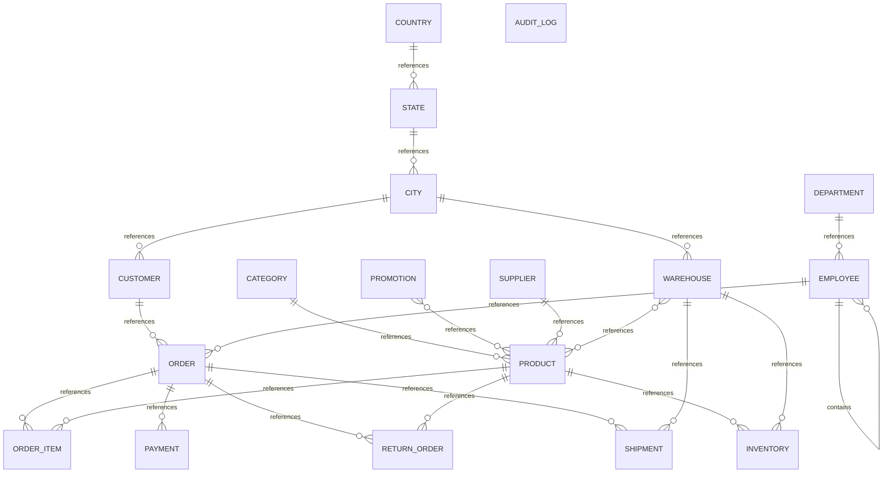

# Executive Summary

A commercial order management and fulfillment system supporting customer acquisition, product catalog management, inventory distribution across warehouses, order processing with line items, payment tracking, shipment orchestration, and return handling. The business operates through a sales team organized by department, manages products across categories with supplier relationships, runs promotional campaigns, and maintains geographic hierarchies of countries, states, cities, and warehouses.

> This conceptual model was generated by **claude-haiku-4-5-20251001** from the deterministic metadata, profile and relationship artifacts. It is an interpretation of the business the database appears to support, and should be reviewed by someone who knows that business. The Assumptions section lists where interpretation happened.

# Business Overview

- **Database:** datamodel
- **Business domains:** 8
- **Business entities:** 18
- **Entity relationships:** 21
- **Business rules identified:** 13

# Business Domains

## Geography

Reference data for locations: countries, states, cities, and warehouse locations.

**Entities:** Country, State, City, Warehouse

## Master Data

Core business reference entities: products, categories, suppliers, employees, departments, customers, and promotions.

**Entities:** Product, Category, Supplier, Employee, Department, Customer, Promotion

## Inventory Management

Tracking product stock levels across warehouses and reorder thresholds.

**Entities:** Inventory

## Sales & Orders

Customer order creation, line items, order status, and sales representative assignment.

**Entities:** Order, Order Item

## Fulfillment

Shipment planning and execution from warehouses to customers.

**Entities:** Shipment

## Payments

Payment processing and tracking for customer orders.

**Entities:** Payment

## Returns

Product return processing and reason tracking.

**Entities:** Return Order

## Audit & Compliance

System audit logging for data change tracking and compliance.

**Entities:** Audit Log

# Business Entities

## Country

A sovereign nation or region where the business operates.

**Business key:** country_code

**Attributes**

- country_code
- country_name
- created_at

**Derived from:** `bronze.country`

## State

A state or province within a country.

**Business key:** state_name, country_id

**Attributes**

- state_name

**Derived from:** `bronze.state`

## City

A city located within a state.

**Business key:** city_name, state_id

**Attributes**

- city_name

**Derived from:** `bronze.city`

## Warehouse

A distribution facility storing inventory and fulfilling shipments.

**Business key:** warehouse_name

**Attributes**

- warehouse_name

**Derived from:** `bronze.warehouse`

## Department

An organizational unit within the company (Finance, Support, Sales, etc.).

**Business key:** department_name

**Attributes**

- department_name

**Derived from:** `bronze.department`

## Employee

A staff member employed by the company, potentially in a sales, administrative, or management capacity.

**Business key:** email

**Attributes**

- first_name
- last_name
- email
- salary
- hire_date

**Derived from:** `bronze.employee`

## Category

A product category used to classify and group products.

**Business key:** category_name

**Attributes**

- category_name

**Derived from:** `bronze.category`

## Supplier

A vendor that supplies products to the company.

**Business key:** supplier_name

**Attributes**

- supplier_name
- contact_name
- email
- phone

**Derived from:** `bronze.supplier`

## Product

A tangible good offered for sale or held in inventory.

**Business key:** sku

**Attributes**

- product_name
- sku
- unit_price
- status

**Derived from:** `bronze.product`

## Promotion

A marketing campaign or discount offer applied to products.

**Business key:** promotion_name

**Attributes**

- promotion_name
- discount_percent

**Derived from:** `bronze.promotion`

## Inventory

The quantity of a specific product held at a specific warehouse, including reorder thresholds.

**Business key:** warehouse_id, product_id

**Attributes**

- quantity
- reorder_level

**Derived from:** `bronze.inventory`

## Customer

A person or organization that purchases products from the company.

**Business key:** customer_number

**Attributes**

- first_name
- last_name
- email
- phone
- credit_limit
- status

**Derived from:** `bronze.customer`

## Order

A request from a customer to purchase one or more products, placed on a specific date with a status.

**Business key:** order_id

**Attributes**

- order_date
- order_status

**Derived from:** `bronze.orders`

## Order Item

A line within an order specifying a product, quantity ordered, and unit price at time of order.

**Business key:** order_id, line_number

**Attributes**

- quantity
- unit_price

**Derived from:** `bronze.order_item`

## Payment

A monetary transaction settling all or part of an order, including method and date.

**Business key:** payment_id

**Attributes**

- payment_method
- payment_date
- amount

**Derived from:** `bronze.payment`

## Shipment

The fulfillment of an order from a warehouse, with tracking information and ship date.

**Business key:** tracking_number

**Attributes**

- shipped_date
- tracking_number

**Derived from:** `bronze.shipment`

## Return Order

A request to return a product from an order, with reason for return.

**Business key:** return_id

**Attributes**

- return_reason

**Derived from:** `bronze.return_order`

## Audit Log

A system record of data modification operations for compliance and change tracking.

**Business key:** audit_id

**Attributes**

- table_name
- operation
- user_name
- operation_timestamp

**Derived from:** `bronze.audit_log`

# Entity Relationships

| Entity | Relationship | Related Entity | Cardinality | Participation |
|---|---|---|---|---|
| Country | references | State | one-to-many | mandatory |
| State | references | City | one-to-many | mandatory |
| City | references | Customer | one-to-many | optional |
| City | references | Warehouse | one-to-many | optional |
| Warehouse | references | Inventory | one-to-many | mandatory |
| Warehouse | references | Product | many-to-many | mandatory |
| Warehouse | references | Shipment | one-to-many | optional |
| Department | references | Employee | one-to-many | optional |
| Employee | contains | Employee | one-to-many | optional |
| Employee | references | Order | one-to-many | optional |
| Category | references | Product | one-to-many | optional |
| Supplier | references | Product | one-to-many | optional |
| Product | references | Inventory | one-to-many | mandatory |
| Product | references | Order Item | one-to-many | optional |
| Product | references | Return Order | one-to-many | optional |
| Promotion | references | Product | many-to-many | mandatory |
| Customer | references | Order | one-to-many | optional |
| Order | references | Order Item | one-to-many | mandatory |
| Order | references | Payment | one-to-many | optional |
| Order | references | Return Order | one-to-many | optional |
| Order | references | Shipment | one-to-many | optional |

# Mermaid Diagram

# Business Rules

1. A customer must have a credit limit to place orders.
2. Products are assigned to exactly one category.
3. Products must be sourced from a supplier, though the supplier assignment is optional in the data.
4. Employees are assigned to a department and report to a manager within the organization.
5. An order must be associated with a customer and a sales representative.
6. Order items reference products and must have a unit price recorded at the time of order.
7. Inventory is tracked as a quantity held at a warehouse for a specific product, with a reorder level threshold.
8. A warehouse is located in a city.
9. Customers are associated with a city.
10. Payments are linked to orders and tracked separately from order creation.
11. Shipments fulfill orders from specific warehouses and generate tracking numbers.
12. Products may be included in zero or more promotions.
13. Return orders reference an order and a product, with a return reason required.

# Assumptions

1. The business operates globally, with country/state/city hierarchies suggesting multi-regional presence, possibly India-based (sample city names: Ahmedabad, Pune, Delhi, Telangana).
2. Employees can be sales representatives (sales_rep_id on Orders) and may also manage other employees (manager_id self-reference), suggesting a hierarchical organization.
3. A customer's city is optional; the business may accept customers without a designated home city or use a default during order placement.
4. The 'customer_number' and 'order_id' fields are assigned by the system, not customer-selected, based on the pattern (CUST001, etc.).
5. Product status and order_status are controlled values (ACTIVE, DELIVERED observed); these are likely enumerations.
6. The Product table's structure includes a foreign reference marked as 'warehouse_id' in role but named 'product_id'; this is treated as the product identifier per standard naming and schema.
7. Payments are optional on orders (nullable order_id), allowing orders to exist without payment recording or with delayed payment.
8. Shipments are optional on orders, implying some orders may not require fulfillment (e.g., digital products or canceled orders).
9. Return orders are optional; not all orders result in returns.
10. Promotion discount percentages are stored as plain decimal values; the business rule for applying discounts to order totals is not visible in the schema.
11. The Audit Log table is disconnected (orphaned) from the main operational model; it records changes to other tables but is not directly queried for business logic.
12. The 'reorder_level' attribute on Inventory has a single distinct value (20 across all records), suggesting it may be a global system parameter stored redundantly or a default not yet varied.
13. The business key for Inventory is the combination of warehouse and product, confirming each warehouse maintains separate stock levels per product.
14. Employee manager_id is self-referencing with 10% nulls, indicating some employees (likely top-level managers) have no manager.
15. Product-Promotion is a pure link table with no additional attributes, representing a many-to-many relationship where products can participate in multiple promotions.

# Recommendations

1. Consider separating Sales and Fulfillment domains more explicitly if order processing and shipment planning are managed by different teams.
2. Audit Log should be documented as a system table supporting compliance and change data capture; clarify whether it is queried for business analytics or only compliance.
3. Reorder_level appears uniform across inventory records; consider whether this should be a global configuration parameter or if product- and warehouse-specific thresholds are needed.
4. Define and document controlled vocabularies for Product.status, Customer.status, Order.order_status, and Payment.payment_method to ensure consistent usage across the business.
5. Consider adding an Order fulfillment status or date to track order state progression independently of shipment records (e.g., picked, packed, ready to ship).
6. The Employee-to-Department relationship is optional in the data; clarify whether all employees must belong to a department or whether contractors/external staff are allowed without department assignment.
7. Consider adding a Product effective date range or versioning to track price and attribute changes over time, especially unit_price which may vary.
8. Confirm whether Customer.credit_limit is hard-enforced at order entry or used only for reporting and risk assessment.
9. Add explicit business rules around return windows (how long after order delivery can returns be requested) if not already enforced in application logic.
10. Warehouse.city is optional; clarify whether warehouses always have a city location or if some are virtual/dropship facilities.
