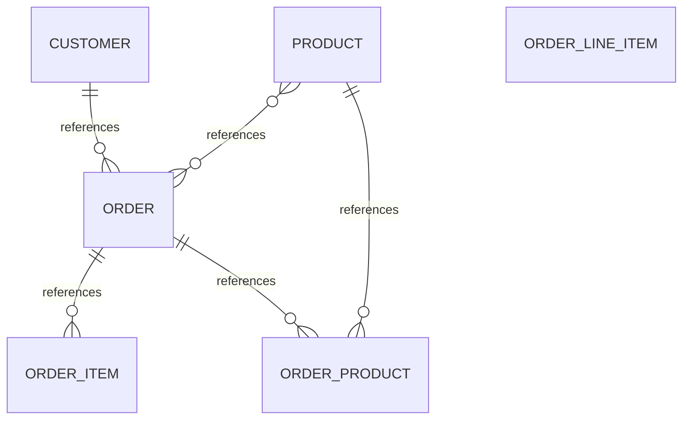

# Executive Summary

An e-commerce order management system that tracks customers, products, and orders. Customers place orders for products, with order line items and pricing tracked. The system manages inventory, customer credit limits, order status and fulfillment, and payment methods.

> This conceptual model was generated by **claude-haiku-4-5-20251001** from the deterministic metadata, profile and relationship artifacts. It is an interpretation of the business the database appears to support, and should be reviewed by someone who knows that business. The Assumptions section lists where interpretation happened.

# Business Overview

- **Database:** datamodel
- **Business domains:** 3
- **Business entities:** 6
- **Entity relationships:** 5
- **Business rules identified:** 9

# Business Domains

## Customer Management

Core customer identity, contact information, and credit management.

**Entities:** Customer

## Product Catalog

Product definitions, inventory levels, and supplier relationships.

**Entities:** Product

## Order Fulfillment

Order creation, line item tracking, status, and shipping.

**Entities:** Order, Order Line Item, Order Product

# Business Entities

## Customer

A party who places orders and purchases products. Identified by a unique customer code.

**Business key:** customer_code

**Attributes**

- first_name
- last_name
- email
- phone_number
- date_of_birth
- gender
- city
- state
- country
- postal_code
- customer_status
- credit_limit
- is_active

**Derived from:** `bronze.customer`

## Product

An item offered for sale. Tracked by product code, with inventory, pricing, category, and supplier information.

**Business key:** product_code

**Attributes**

- product_name
- category
- price
- stock_quantity
- supplier_name
- is_active
- created_date

**Derived from:** `bronze.product`

## Order

A customer purchase transaction containing one or more products, with order status, payment details, and fulfillment tracking.

**Business key:** order_number

**Attributes**

- order_date
- order_status
- payment_method
- total_amount
- tax_amount
- discount_amount
- shipping_amount
- shipped_date
- remarks
- created_by
- created_date

**Derived from:** `bronze.orders`

## Order Line Item

A line item within an order, capturing the product name, quantity ordered, and pricing at order time. Denormalizes product information at the point of order.

**Business key:** order_id, product_name

**Attributes**

- product_name
- quantity
- unit_price
- total_price

**Derived from:** `bronze.order_item`

## Order Product

A line item that links an order to a product with the quantity and selling price at the time of order. Serves as the transaction record for product fulfillment.

**Business key:** order_id, product_id

**Attributes**

- quantity
- selling_price

**Derived from:** `bronze.order_product`

## Order Item

A denormalized order line containing product and pricing details. This entity appears to duplicate Order Product but retains product name as a text field rather than reference.

**Business key:** order_item_id

**Attributes**

- product_name
- quantity
- unit_price
- total_price

**Derived from:** `bronze.order_item`

# Entity Relationships

| Entity | Relationship | Related Entity | Cardinality | Participation |
|---|---|---|---|---|
| Customer | references | Order | one-to-many | mandatory |
| Product | references | Order Product | one-to-many | mandatory |
| Product | references | Order | many-to-many | mandatory |
| Order | references | Order Item | one-to-many | mandatory |
| Order | references | Order Product | one-to-many | mandatory |

# Mermaid Diagram

# Business Rules

1. A customer must have a valid credit limit; every order is associated with exactly one customer.
2. An order is assigned one or more line items; each line item refers to one or more products ordered.
3. The order status is controlled vocabulary: PENDING, SHIPPED, CANCELLED, or DELIVERED based on fulfillment state.
4. Payment method is constrained to Credit Card, Debit Card, or UPI.
5. An order carries tax, discount, and shipping amounts that contribute to the total amount.
6. The shipped_date is optional and only populated when order_status is SHIPPED or later.
7. Products are organized by category (Electronics, Accessories) and sourced from named suppliers.
8. Product pricing and availability (stock_quantity) are maintained in the Product master; order line items capture the selling price at order time.
9. A customer has an account status (ACTIVE or INACTIVE) and credit limit that governs purchasing authority.

# Assumptions

1. The Order Line Item table (bronze.order_item) denormalizes product information at order time (product_name, unit_price, total_price) separately from the Product master. This allows historical pricing to be preserved even if the master product price changes later.
2. The Order Product table (bronze.order_product) is the normalized line item table linking orders to products with quantity and selling_price. It appears to be the authoritative transaction record, while Order Line Item may be a denormalized view or shadow table.
3. Both Order Line Item and Order Product are treated as separate entities rather than consolidated because they carry different attributes (one captures product_name as text, the other captures product_id as reference) and may serve different purposes (reporting vs. fulfillment).
4. The relationship 'bronze.orders.order_id -> bronze.product.product_id [MANY_TO_MANY]' is inferred through the Order Product junction table and does not represent a direct reference but rather the semantic many-to-many association between orders and products.
5. Customer status is a controlled vocabulary (sample shows ACTIVE only, but field allows for other statuses like INACTIVE).
6. Payment methods are constrained to Credit Card, Debit Card, or UPI based on sample data.
7. Order status values include PENDING, SHIPPED, CANCELLED, DELIVERED based on sample range shown (CANCELLED through SHIPPED).
8. The 'remarks' field in Order captures order lifecycle notes such as 'Awaiting Shipment' and 'In Transit'.
9. Customers, Products, and Orders are marked is_active to support soft-delete patterns; is_active=true for all sample rows indicates the base population is active.
10. Two columns were omitted from the Customer table analysis but are present in the source; their business meaning is not inferred.

# Recommendations

1. Clarify the distinction and ownership between Order Line Item and Order Product. If both tables serve the same business purpose, consolidate to a single Order Line entity to reduce redundancy and maintenance cost.
2. Add explicit customer segment or tier information to enable targeted order promotions and credit policy differentiation.
3. Introduce an Order Status History or Audit trail entity to track state transitions (e.g., from PENDING to SHIPPED to DELIVERED) with timestamps, supporting analytics on fulfillment cycle time.
4. Consider a Supplier entity as a distinct master if supplier relationships are core to procurement strategy; currently supplier_name is denormalized in Product.
5. Document the business rules governing when shipped_date is populated versus left null, and whether a not-shipped order can have a shipped_date (33% null suggests conditional logic).
6. Validate whether the omitted columns from the Customer table carry business significance; if not omitted for privacy, include them in the model documentation.
